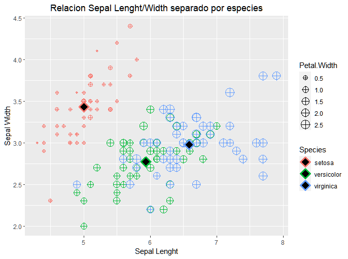

# Postwork Sesión 2.

#### Objetivo

- Conocer algunas de las bases de datos disponibles en `R`
- Observar algunas características y manipular los DataFrames con `dplyr`
- Realizar visualizaciones con `ggplot`
#### Requisitos

1. Tener instalado R y RStudio
2. Haber realizado el prework y estudiado los ejemplos de la sesión.

#### Desarrollo

1) Inspeccionar el DataSet iris_meaniris` disponible directamente en R. Identifica las variables que contiene y su tipo, asegúrate de que no hayan datos faltantes y 
que los datos se encuentran listos para usarse.
```R 
library(ggplot2)
library(dplyr)
iris
```

2) Crear una gráfica de puntos que contenga `Sepal.Lenght` en el eje horizontal, `Sepal.Width` en el eje vertical, que identifique `Species` por color y que el tamaño de la figura está representado por `Petal.Width`. Asegúrate de que la geometría contenga `shape = 10` y `alpha = 0.5`.
```R 
plot(iris$Sepal.Length, iris$Sepal.Width, xlab="Lenght", ylab="Width") ##comparando el plot de rbase con el ggplot
```
<p align="center">
  
</p>
```R 
ggplot(iris, aes(x=Sepal.Length, y=Sepal.Width,color=Species, size=Petal.Width))+geom_point(shape=10, alpha=.5)+xlab("Sepal Lenght") +ggtitle("Relacion SepalLenght/Width separado por especies") + ylab("Sepal Width")
```
<p align="center">
  
</p>


3) Crear una tabla llamada `iris_mean` que contenga el promedio de todas las variables agrupadas por `Species`.
```R 
iris_mean<-iris%>%select(Sepal.Length, Sepal.Width, Petal.Length, Petal.Width, Species)%>%group_by(Species)%>%
  summarize(promsl=mean(Sepal.Length),promSW= mean(Sepal.Width), mean(Petal.Width), mean(Petal.Length))
iris_mean
```

4) Con esta tabla, agregar a la gráfica anterior otra geometría de puntos para agregar los promedios en la visualización. Asegúrate que el primer argumento de la geometría sea el nombre de tu tabla y que los parámetros sean `shape = 23`, `size = 4`, `fill = "black"` y `stroke = 2`. También agrega etiquetas, temas y los cambios necesarios para mejorar tu visualización.
```R 
 ggplot()+ geom_point(data=iris, aes(x=Sepal.Length, y=Sepal.Width,color=Species, size=Petal.Width), shape=10)+
  geom_point(data=iris_mean, aes(x=promsl, y=promSW,color=Species), size=4, fill="black", stroke=2, shape=23)+xlab("Sepal Lenght") +ggtitle("Relacion Sepal Lenght/Width separado por especies") + ylab("Sepal Width")+
  theme(plot.title = element_text(hjust = 0.5))
 ```
 <p align="center">
  
</p>

#### Ir al archivo de código fuente
- [PostWork 2](https://github.com/alsolisc/Postworks/tree/main/src/PostWork2.R)
