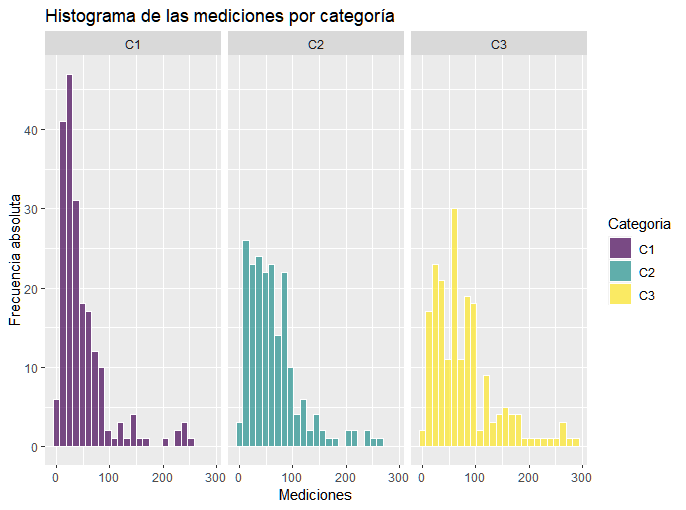
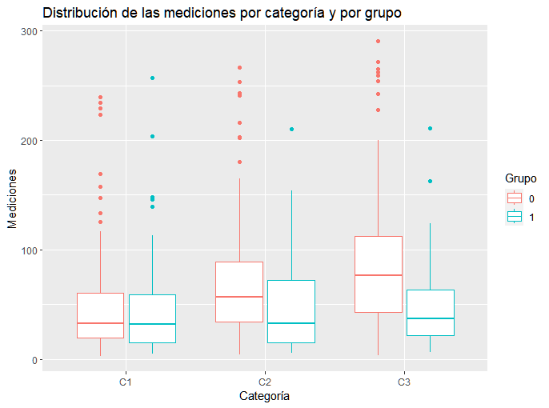

# Postwork Sesión 3

#### Objetivo

- Realizar un análisis descriptivo de las variables de un dataframe

#### Requisitos

1. R, RStudio
2. Haber realizado el prework y seguir el curso de los ejemplos de la sesión
3. Curiosidad por investigar nuevos tópicos y funciones de R

#### Desarrollo

Utilizando el dataframe `boxp.csv` realizar el siguiente análisis descriptivo. No olvidar excluir los missing values y transformar las variables a su
tipo y escala correspondiente.
- [boxp.csv](/boxp.csv)
```r
df <- read.csv("https://raw.githubusercontent.com/beduExpert/Programacion-R-Santander-2022/main/Sesion-03/Data/boxp.csv")
str(df)

"A continuación se convertirán las variables a su escala correspondiente:"
df$Categoria <- factor(df$Categoria,
                       levels = c("C1","C2","C3"),
                       ordered = TRUE)
df$Grupo <- factor(df$Grupo)

"En seguida se realizará la limpieza del data frame:"
df_clean <- na.omit(df)

```

1) Calcular e interpreta las medidas de tendencia central de la variable `Mediciones`
"Medidas de tendendencia central:"
```r
"1) Media aritmética"
mean(df_clean$Mediciones)
"Interpretación: el promedio o media aritmética de las mediciones es de 62.88494."

"2) Media truncada"
mean(df_clean$Mediciones,trim = 0.05)
"Interpretación: La media de los datos sin el 5% superior ni el 5% inferior de los valores es de 56.82308.
Este valor es relativamente lejano de la media aritmética, lo que sugiere la posible presencia de valores
atípicos."

"3) Mediana"
median(df_clean$Mediciones)
"Interpretación: El 50% de las mediciones se encuentra por encima de 49.3 y el otro 50% está por debajo de
dicho valor."

"4) Moda"
library(DescTools)
Mode(df_clean$Mediciones)
"Interpretación:  El valor que ocurre con más frecuencia en este conjunto de datos es 23.3. Dicho valor
se repitió 3 veces."
```

2) Con base al resultado anterior, ¿qué se puede concluir respecto al sesgo de `Mediciones`?

"Con base en los resultados anteriores, se observó que la moda resultó menor que la mediana, y ésta a su
vez fue menor que la media (moda < mediana < media). Por tanto, se concluye que la distribución de los valores
de las mediciones presenta una asimetría positiva o un sesgo hacia la derecha".


3) Calcular e interpretar la desviación estándar y los cuartiles de la distribución de `Mediciones`
```r
"Desviación estándar"
sd(df_clean$Mediciones)
"Interpretación: Los valores de las mediciones se encuentran dispersos en promedio 53.76972 alrededor de la media."

"Cuartiles"
quantile(df_clean$Mediciones,probs = c(0.25,0.50,0.75))

"Interpretación: 
1) Primer cuartil: el 25% acumulado de los datos de mediciones se encuentran por debajo de 23.45.
2) Segundo cuartil: el 50% acumulado de los datos de mediciones se encuentran por debajo de 49.30.
3) Tercer cuartil: el 75% acumulado de los datos de mediciones se encuentran por debajo de 82.85."
```

"4) Con ggplot, realizar un histograma separando la distribución de `Mediciones` por `Categoría`
¿Se considera que sólo una categoría está generando el sesgo?"

```r
library(tidyverse)
k <- ceiling(sqrt(length(df_clean$Mediciones))) 

df_clean %>% 
  ggplot(aes(x = Mediciones,fill=Categoria))+
  geom_histogram(color = "white",bins = k,alpha = 0.7)+
  scale_x_continuous(labels = scales::comma_format())+
  scale_y_continuous(labels = scales::comma_format())+
  ggtitle("Histograma de las mediciones por categoría")+
  xlab("Mediciones")+
  ylab("Frecuencia absoluta")+
  theme_get()+
  facet_grid(~Categoria)
```
  
<p align="center">
  
</p>

" Interpretación: con base en los histogramas de las mediciones separadas por categoría, se observa
que la asimetría positiva se encuentra presente en las tres gráficas, por lo que puede concluirse
que el sesgo lo están generando las tres categorías y no solo una de ellas."


5) Con ggplot, realizar un boxplot separando la distribución de "Mediciones" por "Categoría" 
y por `Grupo` dentro de cada categoría. 
¿Se considera que hay diferencias entre categorías? ¿Los grupos al interior de cada categoría 
podrían estar generando el sesgo?

```r
df_clean %>% 
  ggplot()+
  aes(x = Categoria,y = Mediciones)+
  geom_boxplot()+
  aes(color = Grupo)+
  labs(title = "Distribución de las mediciones por categoría y por grupo")+
  labs(x = "Categoría")+
  labs(y = "Mediciones")
```
<p align="center">
  
</p>

"Interpretación: Con base en la gráfica de caja y bigotes agrupada, se observan
posibles diferencias entre las mediciones por categoría, siendo dichas
mediciones menores para la categoría 1 en comparación con las categorías 2 y 3.
Asimismo, pueden observa valores potencialmente atípicos para todas las categorías.
Por otra parte, puede concluirse que es muy probable que los grupos dentro de las 
categorías estén generando el sesgo, en específico el grupo 0, pues los bigotes 
superiores de sus cajas correspondientes son más largos en comparación con
los de las cajas del grupo 1, y también presentan mayor cantidad de datos 
potencialmente atípicos."
 
#### Ir al archivo de código fuente
- [PostWork 3](https://github.com/alsolisc/Postworks/tree/main/src/PostWork3.R)
