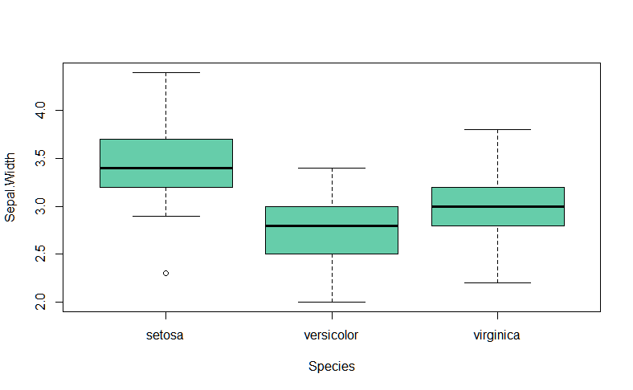

# Postwork Sesión 5

### OBJETIVO

- Realizar inferencia estadística para extraer información de la muestra que sea contrastable con la población

#### REQUISITOS

- Haber desarrollado los postworks anteriores
- Cubrir los temas del prework
- Replicar los ejemplos de la sesión

#### DESARROLLO

El data frame iris contiene información recolectada por Anderson sobre 50 flores 
de 3 especies distintas (setosa, versicolor y virginca), incluyendo medidas en 
centímetros del largo y ancho del sépalo así como de los pétalos.

Estudios recientes sobre las mismas especies muestran que:
- 1) En promedio, el largo del sépalo de la especie setosa (Sepal.Length) es igual a 5.7 cm
- 2) En promedio, el ancho del pétalo de la especie virginica (Petal.Width) es menor a 2.1 cm
- 3) En promedio, el largo del pétalo de la especie virgínica es 1.1 cm más grande
      que el promedio del largo del pétalo de la especie versicolor.
- 4) En promedio, no existe diferencia en el ancho del sépalo entre las 3 especies.

Utilizando pruebas de inferencia estadística, determinar si existe evidencia suficiente 
para concluir que los datos recolectados por Anderson están en línea con los nuevos 
estudios. 

Utilizar 99% de confianza para toda las pruebas, en cada caso realiza el planteamiento 
de hipótesis adecuado y concluye.
```R
library(ggplot2)
summary(iris)
# Sepal.Length    Sepal.Width     Petal.Length    Petal.Width          Species  
#  Min.   :4.300   Min.   :2.000   Min.   :1.000   Min.   :0.100   setosa    :50  
#  1st Qu.:5.100   1st Qu.:2.800   1st Qu.:1.600   1st Qu.:0.300   versicolor:50  
#  Median :5.800   Median :3.000   Median :4.350   Median :1.300   virginica :50  
#  Mean   :5.843   Mean   :3.057   Mean   :3.758   Mean   :1.199                  
#  3rd Qu.:6.400   3rd Qu.:3.300   3rd Qu.:5.100   3rd Qu.:1.800                  
#  Max.   :7.900   Max.   :4.400   Max.   :6.900   Max.   :2.500  
iris$Species <- factor(iris$Species)
```

#### 1. HIPÓTESIS: En promedio, el largo del sépalo de la especie Setosa es de 5.7 cm.
#### Ho: Promedio setosa Sepal.Lenght=5.7
#### Ha: Promedio setosa Sepal.Lenght!=5.7

```R
t.test(iris[iris$Species=="setosa", "Sepal.Length"], alternative="two.sided", 
       mu=5.7)
# One Sample t-test
# 
# data:  iris[iris$Species == "setosa", "Sepal.Length"]
# t = -13.922, df = 49, p-value < 2.2e-16
# alternative hypothesis: true mean is not equal to 5.7
# 95 percent confidence interval:
#  4.905824 5.106176
# sample estimates:
# mean of x 
#     5.006        
       
#NS=0.005, pvalue=2.2e-16
#Dado que pvalue<NS EEE para rechazar la hipótesis nula.
```

#### 2. HIPÓTESIS: En promedio, el ancho del pétalo de la especie virginica es menor a 2.1 cm.
#### Ho:Promedio virginica Petal.With>=2.1
#### Ha=Promedio virginica Petal.With<2.1

```R
t.test(iris[iris$Species=="virginica", "Petal.Width"], alternative="less", 
       mu=2.1)
# One Sample t-test
# 
# data:  iris[iris$Species == "virginica", "Petal.Width"]
# t = -1.9052, df = 49, p-value = 0.03132
# alternative hypothesis: true mean is less than 2.1
# 95 percent confidence interval:
#     -Inf 2.09112
# sample estimates:
# mean of x 
#     2.026 

#NS=0.01, pvalue=0.03132
#Dado que pvalue>NS no EEE para rechazar la hipótesis nula.
```

#### 3. HIPÓTESIS: En promedio, el largo del pétalo de la especie virginica 
#### es 1.1 cm más grande que el promedio del largo del pétalo de la especie versicolor.

```R
mean.virg <- mean(iris[iris$Species=="virginica", "Petal.Length"])
mean.versi <- mean(iris[iris$Species=="versicolor", "Petal.Length"])

#Ho: varianzas iguales
#Ha: varianzas diferentes

var.test(iris[iris$Species=="virginica", "Petal.Length"], iris[iris$Species=="versicolor", "Petal.Length"],
          ratio=1, alternative = "two.sided")
# F test to compare two variances
# 
# data:  iris[iris$Species == "virginica", "Petal.Length"] and iris[iris$Species == "versicolor", "Petal.Length"]
# F = 1.3794, num df = 49, denom df = 49, p-value = 0.2637
# alternative hypothesis: true ratio of variances is not equal to 1
# 95 percent confidence interval:
#  0.7827605 2.4307127
# sample estimates:
# ratio of variances 
#           1.379372 

#NS=0.005, pvalue=0.2637
#Dado que pvalue>NS no EEE para rechazar la Ho, las varianzas son iguales.

#Ho: mean.virg-mean.versi >= 1.1
#Ha: mean.virg-mean.versi < 1.1

t.test(x = iris[iris$Species=="virginica", "Petal.Length"], y = iris[iris$Species=="versicolor", "Petal.Length"],
       alternative = "less", mu=1.1, var.equal=TRUE, conf.level=0.99)
# Two Sample t-test
# 
# data:  iris[iris$Species == "virginica", "Petal.Length"] and iris[iris$Species == "versicolor", "Petal.Length"]
# t = 1.873, df = 98, p-value = 0.968
# alternative hypothesis: true difference in means is less than 1.1
# 99 percent confidence interval:
#      -Inf 1.534434
# sample estimates:
# mean of x mean of y 
#     5.552     4.260 

#NS=0.01, pvalue=0.968
#Dado que p>NS no EEE para rechazar la Ho.
```

#### 4. HIPÓTESIS: En promedio, no existe diferencia en el ancho del sépalo entre las 3 especies.
#### Análisis de varianza pues tenemos más de dos muestras.
#### Ho: no hay diferencias entre las medias de Sepal.Width
#### Ha: hay diferencias entre las medias de Sepal.Width

```R
boxplot(Sepal.Width~Species, data = iris, col = "aquamarine3")
```

<p align="center">
  
</p>

```R
anova <- aov(Sepal.Width ~ Species, data=iris)
summary(anova)
#  Df Sum Sq Mean Sq F value Pr(>F)    
# Species       2  11.35   5.672   49.16 <2e-16 ***
# Residuals   147  16.96   0.115                   
# ---
# Signif. codes:  0 ‘***’ 0.001 ‘**’ 0.01 ‘*’ 0.05 ‘.’ 0.1 ‘ ’ 1
```

#### Ir al archivo de código fuente
- [PostWork 5](https://github.com/alsolisc/Postworks/tree/main/src/PostWork5.R)
