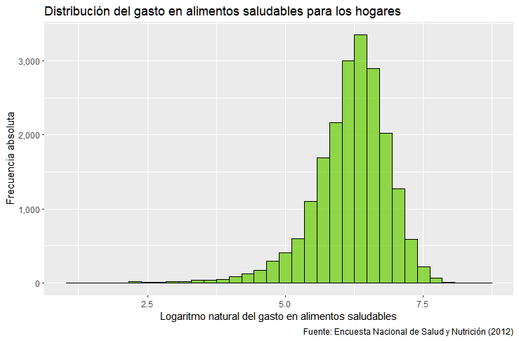
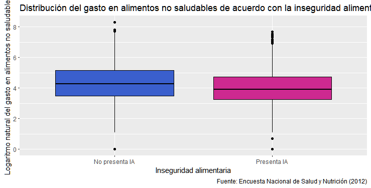
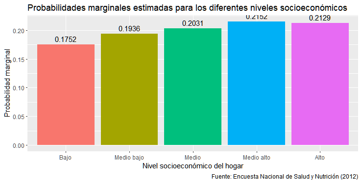

# Postwork Sesión 8

#### Objetivo

### 1. Realizar un análisis estadístico completo de un caso
### 2. Publicar en un repositorio de Github el análisis y el código empleado

#### Requisitos

### 1. Haber realizado los works y postworks previos
### 2. Tener una cuenta en Github o en RStudioCloud

#### Desarrollo

### Un centro de salud nutricional está interesado en analizar estadísticamente y 
### probabilísticamente los patrones de gasto en alimentos saludables y no saludables
### en los hogares mexicanos con base en su nivel socioeconómico, en si el hogar
### tiene recursos financieros extras al ingreso y en si presenta o no inseguridad
### alimentaria. Además, está interesado en un modelo que le permita identificar 
### los determinantes socioeconómicos de la inseguridad alimentaria.

### La base de datos es un extracto de la Encuesta Nacional de Salud y Nutrición (2012)
### levantada por el Instituto Nacional de Salud Pública en México. La mayoría de las 
### personas afirman que los hogares con menor nivel socioeconómico tienden a gastar 
### más en productos no saludables que las personas con mayores niveles socioeconómicos
### y que esto, entre otros determinantes, lleva a que un hogar presente cierta 
### inseguridad alimentaria.

### La base de datos contiene las siguientes variables:
   
### nse5f (Nivel socioeconómico del hogar): 1 "Bajo", 2 "Medio bajo", 3 "Medio", 4 "Medio alto", 5 "Alto"
### area (Zona geográfica): 0 "Zona urbana", 1 "Zona rural"
### numpeho (Número de persona en el hogar)
### refin (Recursos financieros distintos al ingreso laboral): 0 "no", 1 "sí"
### edadjef (Edad del jefe/a de familia)
### sexoje (Sexo del jefe/a de familia): 0 "Hombre", 1 "Mujer"
### añosedu (Años de educación del jefe de familia)
### ln_als (Logaritmo natural del gasto en alimentos saludables)
### ln_alns (Logaritmo natural del gasto en alimentos no saludables)
### IA (Inseguridad alimentaria en el hogar): 0 "No presenta IA", 1 "Presenta IA"

"Como paso previo, se realizará la importación de la base de datos:"

```r
df<-read.csv("https://raw.githubusercontent.com/beduExpert/Programacion-R-Santander-2022/main/Sesion-08/Postwork/inseguridad_alimentaria_bedu.csv")
str(df)
summary(df)
dim(df)
```

"A continuación, se convertirán en factores las variables nse5f, area, refin, sexojef:"

```r
df$nse5f <- factor(df$nse5f)
class(df$nse5f)
df$area <- factor(df$area)
class(df$area)
df$refin <- factor(df$refin)
class(df$refin)
df$sexojef <- factor(df$sexojef)
class(df$sexojef)
df$numpeho <- as.numeric(df$numpeho)
class(df$numpeho)
df$edadjef <- as.numeric(df$edadjef)
class(df$edadjef)
df$añosedu <- as.numeric(df$añosedu)
class(df$añosedu)
class(df$IA)
class(df$ln_als)
class(df$ln_alns)
```

"En seguida, se limpiará la base de datos y se guardará la base limpia en el objeto
df_clean:"

```r
df_clean <- na.omit(df)
dim(df_clean)
df_clean$IA_factor <- factor(df_clean$IA,
                       labels = c("No presenta IA","Presenta IA"))
str(df_clean)
```

"Finalmente, se procederá a dar respuesta a las preguntas planteadas:"


# 1. Plantea el problema del caso

"El objetivo de esta investigación consiste en determinar si algunos aspectos sociodemográficos
de los hogares mexicanos como su nivel socioeconómico, si reciben o no recursos
financieros adicionales a los ingresos laborales, o si presentan o no inseguridad
alimentaria, poseen una influencia sobre los gastos en alimentos saludables o no
saludables. En este sentido, una posible hipótesis de investigación es que el gasto
en alimentos saludables y no saludables de los hogares se ve afectado por los factores
mencionados con anterioridad.

Por otro lado, se presume que el gasto en alimentos no saludables es mayor en los 
hogares con niveles socioeconómicos bajos, y que esto, aunado a otros determinantes,
pueden conducir a que dichos hogares presenten un cierto grado de inseguridad alimentaria.
De esta manera, un segundo objetivo de este estudio consiste en investigar cuáles
variables contribuyen a que se presente el problema de inseguridad alimentaria en los hogares 
mexicanos."


# 2. Realiza un análisis descriptivo de la información

```r
install.packages("tidyverse")
install.packages("moments")
install.packages("DescTools")
install.packages("reshape")
install.packages("rcompanion")
install.packages("ggcorrplot")
library(tidyverse)
library(moments)
library(DescTools)
library(reshape)
library(rcompanion)
library(ggcorrplot)
```

"A) Análisis Estadístico Descriptivo para variables categóricas."

"En primer lugar, se obtendrá una gráfica de barras para mostrarlos porcentajes
de hogares mexicanos que presentaron y que no presentaron inseguridad alimentaria:"

```r
df_clean %>% 
  count(IA_factor) %>% 
  mutate(Porcentaje = prop.table(n)) %>% 
  ggplot(aes(x = IA_factor, y = Porcentaje, fill = IA_factor, label = scales::percent(Porcentaje))) + 
  geom_col(position = 'dodge') +
  geom_text(position = position_dodge(width = .9),    
            vjust = -0.5,   
            size = 3) + 
  scale_y_continuous(labels = scales::percent)+
  xlab("Inseguridad alimentaria en el hogar")+
  ggtitle("Distribución porcentual de la muestra para la inseguridad alimentaria (IA) en el hogar")+
  labs(caption = "Fuente: Encuesta Nacional de Salud y Nutrición (2012)")+
  scale_fill_manual(values=c("lightsteelblue4", "seagreen3"))+
  theme(legend.position = "none")
```

<p align="center">
  
</p>

"De acuerdo con el gráfico anterior, se observa que el 71% de los hogares encuestados
presentó inseguridad alimentaria, mientras que el 29% no presentó este problema.

A continuación se elaborará una gráfica de barras para mostrar cómo se comporta 
la inseguridad alimentaria de acuerdo con el nivel socioeconómico de los hogares:"

```r
df_clean %>% 
  ggplot(aes(x = nse5f, group = IA_factor)) + 
  geom_bar(aes(y = ..prop.., fill = factor(..x..)), stat = "count") +
  geom_text(aes(label = scales::percent(..prop..), y = ..prop.. ),             
            stat = "count", vjust = -.5) +
  labs(y = "Porcentaje", fill="nse5f") +
  facet_grid(~IA_factor) +
  scale_y_continuous(labels = scales::percent)+
  scale_x_discrete(labels= c("Bajo","Medio bajo","Medio","Medio alto","Alto"))+
  xlab("Nivel socioeconómico del hogar")+
  theme(legend.position = "none")+
  ggtitle("Distribución porcentual de la muestra para la inseguridad alimentaria (IA) por nivel socioeconómico del hogar")+
  labs(caption = "Fuente: Encuesta Nacional de Salud y Nutrición (2012)")
```
<p align="center">
  
</p>


"Según los resultados anteriores, puede observarse que conforme el nivel socioeconómico
se incrementa, el porcentaje de hogares que no presentan inseguridad alimentaria (IA)
también aumenta. En este sentido, el 8.53% de los hogares que no presentaron IA
pertenece al nivel socioeconómico bajo, mientras que el 37.13% pertenece al nivel alto.
Respecto de los hogares que presentaron IA, se observa una distribución porcentual casi uniforme
para los primeros cuatro niveles socioeconómicos; mientras que solo el 14.86% de 
los hogares con IA pertenecían al nivel alto.  

En seguida, se construirá el gráfico de de barras de la seguridad alimentaria 
de acuerdo con la zona geográfica donde están localizados los hogares:"

```R
df_clean %>% 
  ggplot(aes(x = area, group = IA_factor)) + 
  geom_bar(aes(y = ..prop.., fill = factor(..x..)), stat = "count") +
  geom_text(aes(label = scales::percent(..prop..), y = ..prop.. ),             
            stat = "count", vjust = -.5) +
  labs(y = "Porcentaje", fill="Zona geográfica") +
  facet_grid(~IA_factor) +
  scale_y_continuous(labels = scales::percent)+
  scale_x_discrete(labels= c("Zona urbana","Zona rural"))+
  xlab("Zona geográfica")+
  scale_fill_manual(values=c("deepskyblue4", "darkorange"))+
  theme(legend.position = "none")+
  ggtitle("Distribución porcentual de la muestra para la inseguridad alimentaria (IA) por zona geográfica")+
  labs(caption = "Fuente: Encuesta Nacional de Salud y Nutrición (2012)")
```

<p align="center">
  
</p>

"Con base en el gráfico obtenido, puede darse cuenta de que el porcentaje de los hogares
que presentaron IA es menor en la zona urbana (66%) y mayor en la zona rural (34%), 
en comparación con los hogares que no presentan IA (77% para zona urbana y 23%
para zona rural). En este sentido, se observa que aproximadamente dos terceras partes 
de los hogares que presenta IA pertenece a la zona urbana y una tercera parte a la zona rural. 

Ahora se realizará el gráfico de de barras de la seguridad alimentaria según si los
hogares cuentan o no con recursos financieros distintos al ingreso laboral:"

```R
df_clean %>% 
  ggplot(aes(x = refin, group = IA_factor)) + 
  geom_bar(aes(y = ..prop.., fill = factor(..x..)), stat = "count") +
  geom_text(aes(label = scales::percent(..prop..), y = ..prop.. ),             
            stat = "count", vjust = -.5) +
  labs(y = "Porcentaje", fill="Recursos financieros") +
  facet_grid(~IA_factor) +
  scale_y_continuous(labels = scales::percent)+
  scale_x_discrete(labels= c("No","Sí"))+
  xlab("Recursos financieros distintos al ingreso laboral")+
  scale_fill_manual(values=c("chartreuse4", "goldenrod1"))+
  theme(legend.position = "none")+
  ggtitle("Distribución porcentual de la muestra para la inseguridad alimentaria (IA) por ingresos adicionales")+
  labs(caption = "Fuente: Encuesta Nacional de Salud y Nutrición (2012)")
```

<p align="center">
  
</p>

"Este gráfico muestra como el porcentaje de los hogares que presentaron IA es menor
para los que no tienen ingresos adicionales (79.1%) y mayor para los que sí (20.9%), 
en comparación con los hogares que no presentan IA (85.5% para los que no tienen
ingresos adicionales y 14.5% para los que sí). En este sentido, se observa que el 79.1%
de los hogares con IA no tienen ingresos adicionales, mientras que el 20.9% sí los tiene.

Para finalizar con el análisis de las variables categóricas, se elaborará el gráfico
de barras de la seguridad alimentaria de acuerdo con el sexo del jefe(a) de familia:"

```R
df_clean %>% 
  ggplot(aes(x = sexojef, group = IA_factor)) + 
  geom_bar(aes(y = ..prop.., fill = factor(..x..)), stat = "count") +
  geom_text(aes(label = scales::percent(..prop..), y = ..prop.. ),             
            stat = "count", vjust = -.5) +
  labs(y = "Porcentaje", fill="Sexo") +
  facet_grid(~IA_factor) +
  scale_y_continuous(labels = scales::percent)+
  scale_x_discrete(labels= c("Hombre","Mujer"))+
  xlab("Sexo del jefe(a) de familia")+
  scale_fill_manual(values=c("powderblue", "lightcoral"))+
  theme(legend.position = "none")+
  ggtitle("Distribución porcentual de la muestra para la inseguridad alimentaria (IA) por sexo del jefe(a) del hogar")+
  labs(caption = "Fuente: Encuesta Nacional de Salud y Nutrición (2012)")
```

<p align="center">
  
</p>


"Este gráfico muestra como el porcentaje de los hogares que presentaron IA es ligeramente menor
para aquellos cuyo jefe de familia es hombre (77.7%) y mayor cuando el jefe de familia es mujer (22.3%), 
en comparación con los hogares que no presentan IA (79.8% cuando el jefe de hogar es hombre y 
20.2% cuando es mujer). En este sentido, se observa que en el 77.7% de los hogares con IA 
el jefe de hogar es hombre, mientras que en el 22.3% el jefe de hogar es mujer."

"B) Análisis Estadístico Descriptivo para variables cuantitativas."

"En primer lugar se analizará el número de personas en los hogares de la muestra:"

```R
mean(df_clean$numpeho)
median(df_clean$numpeho)
Mode(df_clean$numpeho)
Var(df_clean$numpeho)
sd(df_clean$numpeho)
kurtosis(df_clean$numpeho)
skewness(df_clean$numpeho)
quantile(df_clean$numpeho,probs = c(0.25,0.50,0.75))

# > mean(df_clean$numpeho)
# [1] 3.99073
# > median(df_clean$numpeho)
# [1] 4
# > Mode(df_clean$numpeho)
# [1] 4
# attr(,"freq")
# [1] 4857
# > Var(df_clean$numpeho)
# [1] 3.444364
# > sd(df_clean$numpeho)
# [1] 1.8559
# > kurtosis(df_clean$numpeho)
# [1] 5.404399
# > skewness(df_clean$numpeho)
# [1] 0.9393988
# > quantile(df_clean$numpeho,probs = c(0.25,0.50,0.75))
# 25% 50% 75% 
#   3   4   5 

```

"De acuerdo con los resultados anteriores, se concluye que el número promedio
de personas por hogar es de 3.99; el 50% de los hogares tienen por debajo de 4
personas por hogar o por encima de dicho valor; el número de personas por
hogar más frecuente es 4 con 4857 repeticiones. Las tres medidas de tendencia central
coinciden aproximadamente, por lo que se espera que la distribución de los datos
sea simétrica. La varianza es de 3.44 y la desviación estándar de 1.86, lo que significa
que en promedio, los datos se dispersan 1.86 personas de la media. La curtosis
es de 5.40, lo que sugiere una distribución leptocúrtica. La asimetría fue de 0.94,
sugiriendo un sesgo derecho. Por último, respecto de los cuartiles, el 25%
acumulado de los hogares tienen 3 personas o menos, el 50% acumulado de los hogares
tienen 4 personas o menos y el 75% acumulado de los hogares tiene 5 personas o menos.
Ahora, se obtendrá el histograma de esta variable y el diagrama de caja y bigotes
categorizado según la seguridad alimentaria:"

```R
k <- ceiling(1+3.322*log(nrow(df_clean))) # Número de clases del histograma

df_clean %>% 
  ggplot(aes(x = numpeho))+
  geom_histogram(color = "black",fill = "darkseagreen2",bins = k,alpha = 0.7)+
  scale_x_continuous(labels = scales::comma_format())+
  scale_y_continuous(labels = scales::comma_format())+
  ggtitle("Distribución del número de personas por hogar")+
  xlab("Número de personas por hogar")+
  ylab("Frecuencia absoluta")+
  theme_get()+
  labs(caption = "Fuente: Encuesta Nacional de Salud y Nutrición (2012)")
```

<p align="center">
  
</p>


"En el histograma anterior puede apreciarse un sesgo positivo en la distribución,
lo que indica una mayor concentración de los datos en la parte inferior del histograma
y la presencia de posibles valores atípicos."

```R
df_clean %>% 
  ggplot(aes(y = numpeho, x= IA_factor,fill=IA_factor))+
  geom_boxplot(col = "black")+
  xlab("Inseguridad alimentaria")+
  ylab("Número de personas en el hogar")+
  scale_fill_manual(values=c("royalblue4", "mediumspringgreen"))+
  theme(legend.position = "none")+
  ggtitle("Distribución del número de personas por hogar de acuerdo con la inseguridad alimentaria (IA)")+
  labs(caption = "Fuente: Encuesta Nacional de Salud y Nutrición (2012)")
```

<p align="center">
  
</p>

"Con base en el gráfico anterior, se observa que la distribución del número de personas
por hogar tiene un sesgo positivo mayor para los hogares presentan inseguridad alimentaria
que para los que no tienen dicho problema."

"En segundo lugar se analizará la edad del jefe(a) de familia de los hogares de la muestra:"

```R
mean(df_clean$edadjef)
median(df_clean$edadjef)
Mode(df_clean$edadjef)
Var(df_clean$edadjef)
sd(df_clean$edadjef)
kurtosis(df_clean$edadjef)
skewness(df_clean$edadjef)
quantile(df_clean$edadjef,probs = c(0.25,0.50,0.75))

# > mean(df_clean$edadjef)
# [1] 47.31534
# > median(df_clean$edadjef)
# [1] 46
# > Mode(df_clean$edadjef)
# [1] 38
# attr(,"freq")
# [1] 561
# > Var(df_clean$edadjef)
# [1] 228.1733
# > sd(df_clean$edadjef)
# [1] 15.10541
# > kurtosis(df_clean$edadjef)
# [1] 2.727005
# > skewness(df_clean$edadjef)
# [1] 0.4853323
# > quantile(df_clean$edadjef,probs = c(0.25,0.50,0.75))
# 25% 50% 75% 
#  36  46  57 

```

"De acuerdo con los resultados anteriores, se concluye que la edad promedio del
jefe(a) de familia es de 47.32 años; el 50% de los jefes de hogar tienen una edad por debajo de 46
años o por encima de dicho valor; la edad más frecuente es de 38 años, con 561 repeticiones.
La moda es menor que la mediana, y esta última es menor que la media, lo que sugiere una distribución
con sesgo positivo. La varianza es de 228.17 y la desviación estándar de 15.11, lo que 
significa que en promedio, los datos se dispersan 15.11 años de la media. La curtosis
es de 2.73, lo que es indicativo de una distribución platicúrtica. La asimetría fue de 0.49,
sugiriendo un ligero sesgo derecho. Por último, respecto de los cuartiles, el 25%
acumulado de los jefes de hogar tienen 36 años o menos, el 50% acumulado de los jefes de hogar
tienen 46 años o menos y el 75% acumulado de los jefes de hogar tiene 57 años o menos.
Ahora, se obtendrá el histograma de esta variable y el diagrama de caja y bigotes
categorizado según la seguridad alimentaria:"

```R
k <- ceiling(1+3.322*log(nrow(df_clean))) # Número de clases del histograma

df_clean %>% 
  ggplot(aes(x = edadjef))+
  geom_histogram(color = "black",fill = "goldenrod1",bins = k,alpha = 0.7)+
  scale_x_continuous(labels = scales::comma_format())+
  scale_y_continuous(labels = scales::comma_format())+
  ggtitle("Distribución de la edad del jefe(a) del hogar")+
  xlab("Edad del jefe(a) del hogar")+
  ylab("Frecuencia absoluta")+
  theme_get()+
  labs(caption = "Fuente: Encuesta Nacional de Salud y Nutrición (2012)")
```

<p align="center">
  
</p>

"En el histograma anterior puede apreciarse un ligero sesgo positivo, así como una
variabilidad considerable."

```R
df_clean %>% 
  ggplot(aes(y = edadjef, x= IA_factor,fill=IA_factor))+
  geom_boxplot(col = "black")+
  xlab("Inseguridad alimentaria")+
  ylab("Edad del jefe(a) del hogar (años)")+
  scale_fill_manual(values=c("royalblue4", "mediumspringgreen"))+
  theme(legend.position = "none")+
  ggtitle("Distribución de la edad del jefe(a) del hogar de acuerdo con la inseguridad alimentaria (IA)")+
  labs(caption = "Fuente: Encuesta Nacional de Salud y Nutrición (2012)")
```

<p align="center">
  
</p>

"Con base en el gráfico anterior, se observa que es la distribución de la edad de 
los jefes(as) de hogar es muy parecida tanto para los hogares que presentan IA como
para los que no la presentan. En este sentido, aparentemente no se aprecian diferencias 
entre ambos grupos respecto de la edad del jefe(a) de hogar."

"A continuación, se analizarán los años de educación del jefe de familia de los hogares de la muestra:"

```R
mean(df_clean$añosedu)
median(df_clean$añosedu)
Mode(df_clean$añosedu)
Var(df_clean$añosedu)
sd(df_clean$añosedu)
kurtosis(df_clean$añosedu)
skewness(df_clean$añosedu)
quantile(df_clean$añosedu,probs = c(0.25,0.50,0.75))

# > mean(df_clean$añosedu)
# [1] 10.89896
# > median(df_clean$añosedu)
# [1] 12
# > Mode(df_clean$añosedu)
# [1] 9
# attr(,"freq")
# [1] 8165
# > Var(df_clean$añosedu)
# [1] 22.04527
# > sd(df_clean$añosedu)
# [1] 4.695239
# > kurtosis(df_clean$añosedu)
# [1] 3.799004
# > skewness(df_clean$añosedu)
# [1] -0.4102551
# > quantile(df_clean$añosedu,probs = c(0.25,0.50,0.75))
# 25% 50% 75% 
#   9  12  12 

```

"De acuerdo con los resultados anteriores, se concluye que los años promedio de educación del
jefe(a) de familia son de 10.90; el 50% de los jefes de hogar tienen un grado de escolaridad por debajo de 12
años o por encima de dicho valor; el grado de escolaridad más frecuente es de 9 años, con 8165 repeticiones.
La varianza es de 22.05 y la desviación estándar de 4.70, lo que significa que en promedio, 
los datos se dispersan 4.70 años de la media. La curtosis es de 3.80, lo que es indicativo de una
distribución leptocúrtica. La asimetría fue de -0.41, sugiriendo un ligero sesgo negativo. 
Por último, respecto de los cuartiles, el 25% acumulado de los jefes de hogar tienen un
grado de escolaridad de 9 años o menos, el 50% acumulado de los jefes de hogar tienen un grado
de escolaridad de 12 años o menos y el 75% acumulado de los jefes de hogar tiene un grado de 
escolaridad de 12 años o menos.Ahora, se obtendrá el histograma de esta variable y el diagrama de caja y bigotes
categorizado según la seguridad alimentaria:"

```R
k <- ceiling(1+3.322*log(nrow(df_clean))) # Número de clases del histograma

df_clean %>% 
  ggplot(aes(x = añosedu))+
  geom_histogram(color = "black",fill = "gray48",bins = k,alpha = 0.7)+
  scale_x_continuous(labels = scales::comma_format())+
  scale_y_continuous(labels = scales::comma_format())+
  ggtitle("Distribución del grado de escolaridad del jefe(a) del hogar")+
  xlab("Grado de escolaridad del jefe(a) del hogar (años)")+
  ylab("Frecuencia absoluta")+
  theme_get()+
  labs(caption = "Fuente: Encuesta Nacional de Salud y Nutrición (2012)")
```

<p align="center">
  
</p>

"En el histograma anterior puede apreciarse que los grados de escolaridad más
frecuentes de los jefes de hogar, en orden descendente, son 9, 12 y 15 años."

```R
df_clean %>% 
  ggplot(aes(y = añosedu, x= IA_factor,fill=IA_factor))+
  geom_boxplot(col = "black")+
  xlab("Inseguridad alimentaria")+
  ylab("Grado de escolaridad del jefe del hogar (años)")+
  scale_fill_manual(values=c("azure3", "antiquewhite1"))+
  theme(legend.position = "none")+
  ggtitle("Distribución del grado de escolaridad del jefe del hogar de acuerdo con la inseguridad alimentaria (IA)")+
  labs(caption = "Fuente: Encuesta Nacional de Salud y Nutrición (2012)")
```

<p align="center">
  
</p>


"Con base en el gráfico anterior, se observa que la distribución del grado de escolaridad
del jefe de familia de los hogares que no presentan IA tiene una mayor variabilidad que la
de los jefes de familia de los hogares que presentan IA. Asimismo, parece existir un
mayor sesgo negativo para los grados de escolaridad de los jefes de familia de los hogares
con IA con respecto a los que no tienen IA, lo que sugiere que este problema se ve influenciado
por valores extremos bajos de grados de escolaridad de los jefes de familia."

"Se procederá a continuación con el análisis del gasto en alimentos saludables. Es
importante mencionar que estos datos se encuentran en escala logarítmica:"

```R
mean(df_clean$ln_als)
median(df_clean$ln_als)
Mode(df_clean$ln_als)
Var(df_clean$ln_als)
sd(df_clean$ln_als)
kurtosis(df_clean$ln_als)
skewness(df_clean$ln_als)
quantile(df_clean$ln_als,probs = c(0.25,0.50,0.75))

# > mean(df_clean$ln_als)
# [1] 6.191992
# > median(df_clean$ln_als)
# [1] 6.27382
# > Mode(df_clean$ln_als)
# [1] 6.309918
# attr(,"freq")
# [1] 95
# > Var(df_clean$ln_als)
# [1] 0.4741052
# > sd(df_clean$ln_als)
# [1] 0.688553
# > kurtosis(df_clean$ln_als)
# [1] 6.605526
# > skewness(df_clean$ln_als)
# [1] -1.191836
# > quantile(df_clean$ln_als,probs = c(0.25,0.50,0.75))
#      25%      50%      75% 
# 5.843544 6.273820 6.633318

```

"De acuerdo con los resultados anteriores, se concluye que el gasto promedio en alimentos
saludables es de 6.19; el 50% de los hogares presentan un gasto en alimentos saludables por 
debajo de 6.27 por encima de dicho valor; el gasto en alimentos saludables más frecuente es 
de 6.30, con 95 repeticiones. La moda es mayor que la mediana, y esta última es mayor que la media, 
lo que sugiere una distribución con sesgo negativo. La varianza es de 0.47 y la desviación 
estándar de 0.69, lo quesignifica que en promedio, los datos se dispersan 0.69 de la media. 
La curtosis es de 6.61, lo que es indicativo de una distribución leptoticúrtica. La asimetría 
es de de -1.19, sugiriendo un sesgo izquierdo. Por último, respecto de los cuartiles, el 25%
acumulado de los hogares tiene un gasto en alimentos saludables de 5.84 o menos, el 50% acumulado
de los hogares tiene un gasto en alimentos saludables de 6.27 o menos y el 75% acumulado de 
los hogares tiene un gasto en alimentos saludables de 6.63 o menos. Ahora, se obtendrá el 
histograma de esta variable y el diagrama de caja y bigotes categorizado según la seguridad
alimentaria:"

```R
k <- ceiling(1+3.322*log(nrow(df_clean))) # Número de clases del histograma

df_clean %>% 
  ggplot(aes(x = ln_als))+
  geom_histogram(color = "black",fill = "chartreuse3",bins = k,alpha = 0.7)+
  scale_x_continuous(labels = scales::comma_format())+
  scale_y_continuous(labels = scales::comma_format())+
  ggtitle("Distribución del gasto en alimentos saludables para los hogares")+
  xlab("Logaritmo natural del gasto en alimentos saludables")+
  ylab("Frecuencia absoluta")+
  theme_get()+
  labs(caption = "Fuente: Encuesta Nacional de Salud y Nutrición (2012)")
```

<p align="center">
  
</p>


"En el histograma anterior puede apreciarse que éste presenta una asimetría negativa,
presentando potencialess valores atípicos en la cola inferior de la distribución, así
como una mayor concentración de los gastos en el extremo derecho del gráfico."


```R
df_clean %>% 
  ggplot(aes(y = ln_als, x= IA_factor,fill=IA_factor))+
  geom_boxplot(col = "black")+
  xlab("Inseguridad alimentaria")+
  ylab("Logaritmo natural del gasto en alimentos saludables")+
  scale_fill_manual(values=c("firebrick3", "lightslateblue"))+
  theme(legend.position = "none")+
  ggtitle("Distribución del gasto en alimentos saludables de acuerdo con la inseguridad alimentaria (IA)")+
  labs(caption = "Fuente: Encuesta Nacional de Salud y Nutrición (2012)")
```

<p align="center">
  
</p>


"Con base en el gráfico anterior, se observa que parece existir un mayor sesgo negativo 
para el gasto en alimentos saludables de los hogares con IA con respecto a los que no tienen IA,
lo que sugiere que este problema se ve influenciado por valores extremos bajos de
gasto en alimentos saludables."

"A continuación se construirá el diagrama de caja y bigotes categorizado según el nivel
socioeconómico:"

```R
df_clean %>% 
  ggplot(aes(y = ln_als, x= nse5f,fill= nse5f))+
  geom_boxplot(col = "black")+  
  xlab("Nivel socioeconómico")+
  ylab("Logaritmo natural del gasto en alimentos saludables")+
  scale_fill_manual(values=c("deepskyblue2", "darkmagenta","green3","red2","yellow2"))+
  scale_x_discrete(labels= c("Bajo","Medio bajo","Medio","Medio alto","Alto"))+
  theme(legend.position = "none")+
  ggtitle("Distribución del gasto en alimentos saludables por nivel socioeconómico")+
  labs(caption = "Fuente: Encuesta Nacional de Salud y Nutrición (2012)")
```

<p align="center">
  
</p>


"Con base en el gráfico anterior, se observa que el gasto en alimentos saludables
tiende a incrementarse a medida que el nivel socioeconómico aumenta, lo que sugiere
que los hogares con mayor nivel socioeconómico aparentemente gastan más en alimentos
saludables que los hogares con menor nivel socioeconómico."

"Ahora se construirá el diagrama de caja y bigotes categorizado según si el
hogar recibe recursos financieros adicionales a los laborales:"

```R
df_clean %>% 
  ggplot(aes(y = ln_als, x= refin,fill= refin))+
  geom_boxplot(col = "black")+  
  xlab("Recursos financieros distintos al ingreso laboral")+
  ylab("Logaritmo natural del gasto en alimentos saludables")+
  scale_fill_manual(values=c("deepskyblue2", "darkmagenta"))+
  scale_x_discrete(labels= c("No","Sí"))+
  theme(legend.position = "none")+
  ggtitle("Distribución del gasto en alimentos saludables por recursos financieros distintos al ingreso laboral")+
  labs(caption = "Fuente: Encuesta Nacional de Salud y Nutrición (2012)")
```

<p align="center">
  
</p>


"Con base en el gráfico anterior, se observa que el gasto en alimentos saludables
para los hogares que reciben recursos financieros distintos al ingreso laboral es
ligeramente mayor que para los que no reciben dichos recursos."

"Finalmente, se desarrollará el análisis del gasto en alimentos no saludables. Es
importante mencionar que estos datos se encuentran en escala logarítmica:"

```R
mean(df_clean$ln_alns)
median(df_clean$ln_alns)
Mode(df_clean$ln_alns)
Var(df_clean$ln_alns)
sd(df_clean$ln_alns)
kurtosis(df_clean$ln_alns)
skewness(df_clean$ln_alns)
quantile(df_clean$ln_alns,probs = c(0.25,0.50,0.75))

# > mean(df_clean$ln_alns)
# [1] 4.118845
# > median(df_clean$ln_alns)
# [1] 4.007333
# > Mode(df_clean$ln_alns)
# [1] 3.401197
# attr(,"freq")
# [1] 1443
# > Var(df_clean$ln_alns)
# [1] 1.084671
# > sd(df_clean$ln_alns)
# [1] 1.041476
# > kurtosis(df_clean$ln_alns)
# [1] 2.579893
# > skewness(df_clean$ln_alns)
# [1] 0.2431928
# > quantile(df_clean$ln_alns,probs = c(0.25,0.50,0.75))
#      25%      50%      75% 
# 3.401197 4.007333 4.867534 

```

"De acuerdo con los resultados anteriores, se concluye que el gasto promedio en alimentos
no saludables es de 4.12; el 50% de los hogares presentan un gasto en alimentos no saludables por 
debajo de 4.01 por encima de dicho valor; el gasto en alimentos no saludables más frecuente es 
de 3.40, con 1443 repeticiones. La moda es menor que la mediana, y esta última es menor que la media, 
lo que sugiere una distribución con sesgo positivo. La varianza es de 1.08 y la desviación 
estándar de 1.04, lo que significa que en promedio, los datos se dispersan 1.04 de la media. 
La curtosis es de 2.58, lo que es indicativo de una distribución platicúrtica. La asimetría 
es de de 0.24, sugiriendo un sesgo derecho. Por último, respecto de los cuartiles, el 25%
acumulado de los hogares tiene un gasto en alimentos no saludables de 3.40 o menos, el 50% acumulado
de los hogares tiene un gasto en alimentos no saludables de 4.01 o menos y el 75% acumulado de 
los hogares tiene un gasto en alimentos no saludables de 4.87 o menos. Ahora, se obtendrá el 
histograma de esta variable y el diagrama de caja y bigotes categorizado según la seguridad
alimentaria:"

```
k <- ceiling(1+3.322*log(nrow(df_clean))) # Número de clases del histograma

df_clean %>% 
  ggplot(aes(x = ln_alns))+
  geom_histogram(color = "black",fill = "mistyrose4",bins = k,alpha = 0.7)+
  scale_x_continuous(labels = scales::comma_format())+
  scale_y_continuous(labels = scales::comma_format())+
  ggtitle("Distribución del gasto en alimentos no saludables para los hogares")+
  xlab("Logaritmo natural del gasto en alimentos no saludables")+
  ylab("Frecuencia absoluta")+
  theme_get()+
  labs(caption = "Fuente: Encuesta Nacional de Salud y Nutrición (2012)")
```

<p align="center">
  
</p>


"En el histograma anterior puede apreciarse que éste presenta una ligera asimetría positiva,
presentando potenciales valores atípicos en la cola superior de la distribución, así
como una mayor concentración de los gastos en el extremo izquierdo del gráfico."

```R
df_clean %>% 
  ggplot(aes(y = ln_alns, x= IA_factor,fill=IA_factor))+
  geom_boxplot(col = "black")+
  xlab("Inseguridad alimentaria")+
  ylab("Logaritmo natural del gasto en alimentos no saludables")+
  scale_fill_manual(values=c("royalblue3", "maroon3"))+
  theme(legend.position = "none")+
  ggtitle("Distribución del gasto en alimentos no saludables de acuerdo con la inseguridad alimentaria (IA)")+
  labs(caption = "Fuente: Encuesta Nacional de Salud y Nutrición (2012)")
```
  
<p align="center">
  
</p>


"Con base en el gráfico anterior, se observa que el gasto en alimentos no saludables
es ligeramente menor para los hogares que presentan IA que para los que no presentan 
este problema, lo que sugiere que los hogares con IA aparentemente gastan menos en alimentos no
saludables."

"En seguida se construirá el diagrama de caja y bigotes categorizado según el nivel
socioeconómico:"

```R
df_clean %>% 
  ggplot(aes(y = ln_alns, x= nse5f,fill= nse5f))+
  geom_boxplot(col = "black")+  
  xlab("Nivel socioeconómico")+
  ylab("Logaritmo natural del gasto en alimentos no saludables")+
  scale_fill_manual(values=c("deepskyblue2", "darkmagenta","green3","red2","yellow2"))+
  scale_x_discrete(labels= c("Bajo","Medio bajo","Medio","Medio alto","Alto"))+
  theme(legend.position = "none")+
  ggtitle("Distribución del gasto en alimentos no saludables por nivel socioeconómico")+
  labs(caption = "Fuente: Encuesta Nacional de Salud y Nutrición (2012)")
```

<p align="center">
  
</p>


"Con base en el gráfico anterior, se observa que el gasto en alimentos no saludables
tiende a incrementarse a medida que el nivel socioeconómico aumenta, lo que sugiere
que los hogares con mayor nivel socioeconómico aparentemente gastan más en alimentos
no saludables que los hogares con menor nivel socioeconómico."

"Por último se construirá el diagrama de caja y bigotes categorizado según si el
hogar recibe recursos financieros adicionales a los laborales:"

```R
df_clean %>% 
  ggplot(aes(y = ln_alns, x= refin,fill= refin))+
  geom_boxplot(col = "black")+  
  xlab("Recursos financieros distintos al ingreso laboral")+
  ylab("Logaritmo natural del gasto en alimentos no saludables")+
  scale_fill_manual(values=c("deepskyblue2", "darkmagenta"))+
  scale_x_discrete(labels= c("No","Sí"))+
  theme(legend.position = "none")+
  ggtitle("Distribución del gasto en alimentos no saludables por recursos financieros distintos al ingreso laboral")+
  labs(caption = "Fuente: Encuesta Nacional de Salud y Nutrición (2012)")
```

<p align="center">
  
</p>

"Con base en el gráfico anterior, se observa que el gasto en alimentos no saludables
para los hogares que reciben recursos financieros distintos al ingreso laboral es
ligeramente menor que para los que no reciben dichos recursos."

```R
df_clean %>% 
  ggplot(aes(y = ln_alns, x= nse5f,fill= IA_factor))+
  geom_boxplot(col = "black")+  
  xlab("Nivel socioeconómico")+
  ylab("Logaritmo natural del gasto en alimentos no saludables")+
  scale_fill_manual("Inseguridad alimentaria (IA)", values=c("deepskyblue2", "darkmagenta"))+
  scale_x_discrete(labels= c("Bajo","Medio bajo","Medio","Medio alto","Alto"))+
  ggtitle("Distribución del gasto en alimentos no saludables por nivel socioeconómico e inseguridad alimentaria")+
  labs(caption = "Fuente: Encuesta Nacional de Salud y Nutrición (2012)")
```

<p align="center">
  
</p>
  
  
"Con base en el gráfico anterior, se observa que el gasto en alimentos no saludables
se incrementa conforme aumenta el nivel socioeconómico; sin embargo, para todos los niveles,
dichos gastos son ligeramente menores en los hogares con IA que en los que no tienen IA."

"C) Análisis Estadístico Descriptivo multivariado."

"Se realizará una matriz de correlación para determinar cuáles variables se
correlacionan entre sí:"

```R
# Se volverá a importar el dataframe
df2 <- read.csv("https://raw.githubusercontent.com/beduExpert/Programacion-R-Santander-2022/main/Sesion-08/Postwork/inseguridad_alimentaria_bedu.csv")
ndf <- na.omit(df2)
str(ndf)
corr_matrix <- round(cor(ndf[,c(1,3,5,7,9,10)],method = "spearman"),2)
corr_matrix
head(corr_matrix[, 1:6])
ggcorrplot(corr_matrix, 
           hc.order = TRUE, 
           outline.col = "white", 
           type = "lower", 
           lab=TRUE, 
           insig = "blank")
```

<p align="center">
  
</p>

"Con base en este análisis, puede observarse que el logaritmo del gasto en alimentos
saludables se correlaciona de forma moderada y positiva con el  nivel socioeconómico, 
los años de educación y el número de personas por hogar, mientras que se correlaciona
débil y negativamente con la edad del jefe de familia. Por otro lado, se observa que
el logaritmo del gasto en alimentos no saludables se correlaciona de forma moderada
y positiva con el nivel socioeconómico y los años de educación, mientras que se 
correlaciona débil y negativamente con el número de personas por hogar y la edad
del jefe de familia."


# 3. Calcula probabilidades que nos permitan entender el problema en México

"Para responder esta pregunta, primero se elaborarán tablas de frecuencias relativas
para estimar la probabilidad marginal de que los hogares de la encuesta pertenezcan a
los niveles socioeconómicos bajo, medio bajo, medio, medio alto y alto; la probabilidad
marginal de que los hogares de la encuesta presenten inseguridad alimentaria o no; y
la probabilidad conjunta para las dos variables anteriores."

"Las probabilidades marginales de que los hogares de la encuesta pertenecan a los
diferentes niveles socioeconómicos son:"

```R
margin_nivel <-
  df_clean %>%
  count(nse5f) %>%
  mutate(prop = n / sum(n))
margin_nivel

ggplot(df_clean, aes(nse5f,fill=nse5f)) + 
  geom_bar(aes(y = (..count..)/sum(..count..))) +
  geom_text(aes(label = scales::comma((..count..)/sum(..count..)),
                y= (..count..)/sum(..count..)), stat= "count", vjust = -0.5) +
  scale_y_continuous(labels=scales::comma) +
  ylab("Probabilidad marginal")+
  xlab("Nivel socioeconómico del hogar")+
  ggtitle("Probabilidades marginales estimadas para los diferentes niveles socioeconómicos")+
  theme_gray()+
  scale_x_discrete(labels= c("Bajo","Medio bajo","Medio","Medio alto","Alto"))+
  xlab("Nivel socioeconómico del hogar")+
  theme(legend.position = "none")+
  labs(caption = "Fuente: Encuesta Nacional de Salud y Nutrición (2012)")
```

<p align="center">
  
</p>


"Con base en los resultados anteriores, se estima que la probabilidad de que el
hogar encuestado pertenezca al nivel socioeconómico bajo es de 0.1752, al nivel
medio bajo es de 0.1936, al nivel medio es de 0.2031, al nivel medio alto es de
0.2152 y al nivel alto es de 0.2129. En otras palabras, la mayor proporción de 
los hogares encuestados pertenece al nivel socioeconómico medio alto y la menor
al nivel bajo."

"Las probabilidades marginales de que los hogares de la encuesta presenten o no
inseguridad alimentaria son:"

```R
margin_IA <-
  df_clean %>%
  count(IA_factor) %>%
  mutate(prop = n / sum(n))
margin_IA

ggplot(df_clean, aes(IA_factor,fill=IA_factor)) + 
  geom_bar(aes(y = (..count..)/sum(..count..))) +
  geom_text(aes(label = scales::comma((..count..)/sum(..count..)),
                y= (..count..)/sum(..count..)), stat= "count", vjust = -0.5) +
  scale_y_continuous(labels=scales::comma) +
  ylab("Probabilidad marginal")+
  xlab("Inseguridad alimentaria (IA) en el hogar")+
  ggtitle("Probabilidades marginales estimadas para la inseguridad alimentaria en el hogar")+
  theme_gray()+
  scale_fill_manual(values=c("royalblue3", "maroon3"))+
  theme(legend.position = "none")+
  labs(caption = "Fuente: Encuesta Nacional de Salud y Nutrición (2012)")
```
<p align="center">
  
</p>

"Con base en los resultados anteriores, se estima que la probabilidad de que el
hogar encuestado no presente IA es de 0.2886, mientras que la probabilidad de que
el hogar presente IA es de 0.7114. En resumen, existe una mayor proporción 
de hogares encuestados que presentan IA que de hogares que no presentan este problema."

"Para finalizar, se calculará la probabilidad (conjunta) de que el hogar encuestado
pertenezca a x nivel socioeconómico y el hogar encuestado presente o no IA:"

## Tabla de probabilidades conjuntas

```R
conjunta_nivel_IA <-
  df_clean %>%
  count(nse5f,IA_factor) %>%
  ungroup() %>% 
  mutate(prop_nivel_IA = n / sum(n))
conjunta_nivel_IA

tabla <- table(df_clean$nse5f,df_clean$IA_factor)
tabla.matriz <- as.matrix(tabla)
tabla.matriz <- round(tabla.matriz/sum(tabla.matriz),4)
tabla.matriz
tabla.df <- melt(tabla.matriz)
tabla.df <- tabla.df %>% dplyr::rename("Probabilidad conjunta" = value)
```

## A continuación, se elaborará un heatmap

```R
tabla.df %>% 
  ggplot(aes(x = Var1, y = Var2, fill =`Probabilidad conjunta`))+
  geom_tile(color = "white",lwd=1.5,linetype=1) +
  guides(fill = guide_colourbar(barwidth = 0.5,
                                barheight = 20))+
  geom_text(aes(label = `Probabilidad conjunta`),color = "white",size=3)+
  coord_fixed()+
  xlab("Nivel socioeconómico del hogar")+
  ylab("Inseguridad alimentaria (IA)")+
  ggtitle("Mapa de calor de las probabilidades conjuntas estimadas de los hogares encuestados")+
  scale_x_continuous(expand = c(0,0), breaks = 0:5)+
  labs(caption = "Fuente: Encuesta Nacional de Salud y Nutrición (2012)")
```

<p align="center">
  
</p>


"De acuerdo con los resultados anteriores, se observa que a medida que el 
nivel socioeconómico aumenta, la probabilidad de que el hogar presente inseguridad
alimentaria tiende a disminuir. Asimismo, puede darse cuenta de que conforme
el nivel socioeconómico se incrementa, la probabilidad de que el hogar no 
tenga inseguridad alimentaria aumenta."

"En seguida se realizará la determinación de probabilidades para los gastos
en alimentos saludables y no saludables, asumiendo que ambas variables distribuyen
como una normal. En este sentido, se calcularán primero la media y desviación 
estándar para ambas variables:"

```R
#Media y desviación estándar para alimentos saludables
mean_lnas <- mean(df_clean$ln_als)
sd_lnas <- sd(df_clean$ln_als)

#Media y desviación estándar para alimentos no saludables
mean_lnans <- mean(df_clean$ln_alns)
sd_lnans <- sd(df_clean$ln_alns)
```

"A continuación se realizará el cálculo de probabilidad para el gasto
en alimentos saludables, dando respuesta a algunos planteamientos interesantes:"

```R
x <- seq(-4, 4, 0.01)*sd_lnas + mean_lnas
y <- dnorm(x, mean = mean_lnas, sd = sd_lnas) 

plot(x, y, type = "l", xlab = "X", ylab = "f(x)",
     main = "Densidad de Probabilidad Normal", 
     sub = expression(paste(mu == 6.19, " y ", sigma == 0.6885)))
```

<p align="center">
  
</p>


"1. ¿Cuál es la probabilidad de que una familia gaste como máximo $400 en
alimentos saludables?"

```R
x1 <- log(400)

pnorm(q = x1, mean = mean_lnas, sd = sd_lnas, lower.tail = TRUE)

plot(x, y, type = "l", xlab = "Ln(gasto alim saludables)", ylab = "f(x)")
title(main = "Densidad de Probabilidad Normal", 
      sub = expression(paste("P(x<400)=0.3854")))
polygon(c(min(x), x[x<=x1], x1), c(0, y[x<=x1], 0), col="aquamarine3")
```

<p align="center">
  
</p>

>P(X<400)=P(x<5.9915)=0.3854, la probabilidad de que una familia gaste menos
>de $400 en alimentos saludables es del 38.54%."

"2. ¿Cuál es la probabilidad de que una familia gaste más de $600 en alimentos
saludables?"

```R
x2 <- log(600)
1-pnorm(q = x2, mean = mean_lnas, sd = sd_lnas, lower.tail = TRUE)

plot(x, y, type = "l", xlab = "Ln(gasto alim saludables)", ylab = "f(x)")
title(main = "Densidad de Probabilidad Normal", 
      sub = expression(paste("P(x>600)=0.3829")))
polygon(c(x2, x[x>x2], max(x)), c(0, y[x>x2], 0), col="aquamarine3")
```

<p align="center">
  
</p>

>P(X>600)=p(X>6.2146)=0.3829, la probabilidad de que una familia gaste $600
>como mínimo en alimentos saludables es del 38.29%."

"3. ¿Cuál es la probabilidad de que una familia gaste entre $300 y $700 en 
alimentos saludables?"

```R
x3<- log(300)
x4<- log(700)
x3;x4
pnorm(q = x4, mean = mean_lnas, sd = sd_lnas, lower.tail = TRUE)-pnorm(q = x3, mean = mean_lnas, sd = sd_lnas, lower.tail = TRUE)
plot(x, y, type = "l", xlab = "Ln(gasto alim saludables)", ylab = "f(x)")
title(main = "Densidad de Probabilidad Normal", 
      sub = expression(paste("P(300<=X<=700)=0.4598")))
polygon(c(x3, x[x>x3 & x<x4], x4), c(0, y[x>x3 & x<x4], 0), col="aquamarine3")
```

<p align="center">
  
</p>


>P(300<=X<=700)=P(5.7038<=X<=6.5511)=0.4598, la probabilidad de que una familia 
>gaste entre $300 y $700 pesos en alimentos saludables es del 45.98%."

"4. Con una probabilidad de 0.8,¿cuál es el gasto máximo que una familia hace
en alimentos saludables?"

```R
q1<- qnorm(p=0.8, mean=mean_lnas, sd=sd_lnas)
plot(x, y, type = "l", xlab = "x", ylab = "f(x)", 
     sub = expression(paste("X=6.7715=$872.62")))
title(main = "P(ln_als<=X)=0.80")     
polygon(c(min(x), x[x<=q1], q1), c(0, y[x<=q1], 0), col="aquamarine3")
```

<p align="center">
  
</p>


>P(X<=6.7715)=0.8=P(X<=872.62), con una probabilidad del 80% una familia
>gasta un máximo de $872.62 en alimentos saludables."

"5. Con una probabilidad al centro de 0.9 ¿cuáles son los límites de gasto en
alimentos saludables?"

```R
q3<- qnorm(p=0.05, mean=mean_lnas, sd=sd_lnas)
q4<- qnorm(p=0.95, mean=mean_lnas, sd=sd_lnas)
q3;q4
plot(x, y, type = "l", xlab = "Ln(gasto alim saludables)", ylab = "f(x)")
title(main = "Densidad de Probabilidad Normal", sub = expression(paste("P(5.0594<=X<=7.3246)=0.9")))
polygon(c(q3, x[x>q3 & x<q4], q4), c(0, y[x>q3 & x<q4], 0), col="aquamarine3")
```
<p align="center">
  
</p>

>P(5.0594<=X<=7.3246)=0.9=P(157.49<=X<=1,517.11), con una probabilidad al
>centro del 90%, una familia gasta entre $157.49 y $1517.11 en alimentos
>saludables. También puede asegurarse que el 5% gasta menos de $157.49 y
>que el 5% gasta más de $1517.11."

```R
"Como siguiente paso se realizará el cálculo de probabilidad para el gasto
en alimentos no saludables, dando respuesta a algunos planteamientos interesantes:"

w <- seq(-4, 4, 0.01)*sd_lnans + mean_lnans
z <- dnorm(w, mean = mean_lnans, sd = sd_lnans)
```

>1. ¿Cuál es la probabilidad de que una familia gaste como máximo $400 en
>alimentos no saludables?"

```R
w1 <- log(400)

pnorm(q = w1, mean = mean_lnans, sd = sd_lnans, lower.tail = TRUE)
plot(w, z, type = "l", xlab = "Ln(gasto alim no saludables)", ylab = "f(x)")
title(main = "Densidad de Probabilidad Normal", 
      sub = expression(paste("P(x<400)=0.9639")))
polygon(c(min(w), w[w<=w1], w1), c(0, z[w<=w1], 0), col="aquamarine3")
```

<p align="center">
  
</p>

>P(X<400)=P(x<5.9915)=0.9639,la probabilidad de que una familia gaste menos
>de $400 en alimentos no saludables es del 96.39%"

"2. ¿Cuál es la probabilidad de que una familia gaste más de $600 en alimentos
no saludables?"

```R
w2 <- log(600)
1-pnorm(q = w2, mean = mean_lnans, sd = sd_lnans, lower.tail = TRUE)
plot(w, z, type = "l", xlab = "Ln(gasto alim no saludables)", ylab = "f(x)")
title(main = "Densidad de Probabilidad Normal", 
      sub = expression(paste("P(x>600)=0.0144")))
polygon(c(w2, w[w>w2], max(w)), c(0, z[w>w2], 0), col="aquamarine3")
```

<p align="center">
  
</p>

>P(X>600)=p(X>6.2146)=0.0144, la probabilidad de que una familia gaste más
>de $600 en alimentos no saludables es del 1.44%."

"3. ¿Cuál es la probabilidad de que una familia gaste entre $300 y $700 en 
alimentos no saludables?"

```R
w3<- log(300)
w4<- log(700)
w3;w4
pnorm(q = w4, mean = mean_lnans, sd = sd_lnans, lower.tail = TRUE)-
  pnorm(q = w3, mean = mean_lnans, sd = sd_lnans, lower.tail = TRUE)
plot(w, z, type = "l", xlab = "Ln(gasto alim saludables)", ylab = "f(x)")
title(main = "Densidad de Probabilidad Normal", 
      sub = expression(paste("P(300<=X<=700)=0.0543")))
polygon(c(w3, w[w>w3 & w<w4], w4), c(0, z[w>w3 & w<w4], 0), col="aquamarine3")
```

<p align="center">
  
</p>

>P(300<=X<=700)=P(5.7038<=X<=6.5511)=0.0543, la probabilidad de que una
>familia gaste entre $300 y $700 en alimentos no saludables es del 5.43%."

"4. Con una probabilidad de 0.8,¿cuál es el gasto máximo que una familia hace
en alimentos no saludables?"

```R
q2<- qnorm(p=0.8, mean=mean_lnans, sd=sd_lnans)
plot(w, z, type = "l", xlab = "Ln(gasto alim no saludables)", ylab = "f(x)",
     sub = expression(paste("X=4.9954=$147.73")))
title(main = "P(ln_alns<=X)=0.80")     
polygon(c(min(w), w[w<=q2], q2), c(0, z[w<=q2], 0), col="aquamarine3")
```

<p align="center">
  
</p>

>P(X<=4.9954)=0.8=P(X<=147.73), con una probabilidad del 80%, una familia
>gasta máximo $147.73 en alimentos no saludables."

"5. Con una probabilidad al centro de 0.9 ¿cuáles son los límites de gasto en
alimentos no saludables?"

```R
q5<- qnorm(p=0.05, mean=mean_lnans, sd=sd_lnans)
q6<- qnorm(p=0.95, mean=mean_lnans, sd=sd_lnans)
q5;q6
plot(w, z, type = "l", xlab = "Ln(gasto alim no saludables)", ylab = "f(x)")
title(main = "Densidad de Probabilidad Normal", 
      sub = expression(paste("P(2.4058<=X<=5.8319)=0.9")))
polygon(c(q5, w[w>q5 & w<q6], q6), c(0, z[w>q5 & w<q6], 0), col="aquamarine3")
```

<p align="center">
  
</p>


>P(2.4058<=X<=5.8319)=0.9=P(11.09<=X<=341.0), con una probabilidad al centro de
>90%, una familia gasta entre $11.09 y $341.0 en alimentos no saludables."


# 4. Plantea hipótesis estadísticas y concluye sobre ellas para entender el problema en México

"En primer lugar, se realizará un conjunto de pruebas de hipótesis para la media para
los gastos en alimentos saludables y no saludables:"

"1. El promedio de gasto en alimentos saludables es de máximo $500.

H0: La media de gasto es menor o igual a $500 o 6.2146 (escala logarítmica)
H0: mean_lnas<=6.2146
H1: La media de gasto es mayor a $500 o 6.2146 (escala logarítmica)
H1: mean_lnas>6.2146"

```R
t.test(x=df_clean$ln_als, alternative = "less", mu=6.2146)
# 	One Sample t-test
# 
# data:  df_clean$ln_als
# t = -4.6759, df = 20279, p-value = 1.473e-06
# alternative hypothesis: true mean is less than 6.2146
# 95 percent confidence interval:
#      -Inf 6.199945
# sample estimates:
# mean of x 
#  6.191992 

```

>Conclusión: pvalue=1.473e-06, NS=0.05
>Debido a que p-value (1.473e-06)<NS(0.05) EEE para rechazar la Ho, la media
>de gasto en alimentos saludables no es de máximo $500."

"2. El promedio de gasto en alimentos saludables es de $450.

H0: La media de gasto es de $450 o 6.1092 (escala logarítmica).
H0: mean_lnas=6.1092
H1: La media de gasto es difente de $450 o 6.1092 (escala logarítmica).
H1: mean_lnas!=6.1092"

```R
t.test(x=df_clean$ln_als, alternative = "two.sided", mu=6.1092)
# One Sample t-test
# 
# data:  df_clean$ln_als
# t = 17.123, df = 20279, p-value < 2.2e-16
# alternative hypothesis: true mean is not equal to 6.1092
# 95 percent confidence interval:
#  6.182515 6.201469
# sample estimates:
# mean of x 
#  6.191992 
```

>Conclusión: debido a que p-value (2.2e-16)<NS(0.05) EEE para rechazar la Ho, >la media
>de gasto en alimentos saludables no es igual a $450."

"3. El promedio de gasto en alimentos no saludables es de más de $150

H0: La media de gasto en alimentos no saludables es menor o igual a $150 o 
5.0106 (escala logarítmica).
H0: mean_lnans<=5.0106
H1: La media de gasto en alimentos no saludables es mayor a $150 o 
5.0106 (escala logarítmica).
H1: mean_lnans>5.0106"

```R
t.test(x=df_clean$ln_alns, alternative = "greater", mu=5.0106)
# One Sample t-test
# 
# data:  df_clean$ln_alns
# t = -121.94, df = 20279, p-value = 1
# alternative hypothesis: true mean is greater than 5.0106
# 95 percent confidence interval:
#  4.106815      Inf
# sample estimates:
# mean of x 
#  4.118845
```

>Conclusión: debido a que p-value(1)>NS(0.05), no EEE para rechazar la Ho, el >promedio de 
>gasto en alimentos no saludables es menor o igual que $150."

"4. Inferencia a la media sobre las medias de ln_als y ln_alns.
El promedio de gasto en alimentos saludables es mayor que el gasto en 
alimentos no saludables."

"Se verifica si las varianzas son iguales o diferentes.

H0: varianzas iguales
H1: varianzas diferentes"

```R
var.test(df_clean$ln_als, df_clean$ln_alns, ratio = 1, alternative = "two.sided")
# 	F test to compare two variances
# 
# data:  df_clean$ln_als and df_clean$ln_alns
# F = 0.4371, num df = 20279, denom df = 20279, p-value < 2.2e-16
# alternative hypothesis: true ratio of variances is not equal to 1
# 95 percent confidence interval:
#  0.4252277 0.4492950
# sample estimates:
# ratio of variances 
#          0.4370957 

```

>"Conclusión: p-value=2.2e-16, EEE para rechazar Ho, las varianzas no son >iguales."

"H0: La media de gasto en alimentos saludables es menor o igual que la
media de gasto en alimentos no saludables.
H0: mean_lnas<=mean_lnans
H1: La media de gasto en alimentos saludables es mayor que la media de
gasto en alimentos no saludables.
H1: mean_lnas>mean_lnans"

```R
t.test(df_clean$ln_als, df_clean$ln_alns, alternative = "greater", mu=0, var.equal = FALSE)
# Welch Two Sample t-test
# 
# data:  df_clean$ln_als and df_clean$ln_alns
# t = 236.47, df = 35163, p-value < 2.2e-16
# alternative hypothesis: true difference in means is greater than 0
# 95 percent confidence interval:
#  2.058726      Inf
# sample estimates:
# mean of x mean of y 
#  6.191992  4.118845
```

>Conclusión: p-value=2.2e-16, EEE para rechazar Ho, el gasto en alimentos >saludables 
>no es menor o igual que el gasto en alimentos no saludables."

"Por otro lado, se realizará una prueba de hipótesis para proporciones:"

"1. De acuerdo con el Consejo Nacional de Evaluación de la Política de Desarrollo Social,
en el año 2010 el porcentaje de la población que experimentaba algún nivel de inseguridad
alimentaria fue de 44.3%. En este sentido, se realizará una prueba de hipótesis con un
nivel de significancia del 5% para determinar si los datos de la muestra analizada 
proveen evidencia estadística suficiente para demostrar que la proporción de los hogares 
mexicanos que presenta inseguridad alimentaria es mayor que el porcentaje reportado 
por el CONEVAL en el año 2010."

"Hipótesis:

H0: proporción de hogares con inseguridad alimentaria <= 0.443
H1: proporción de hogares con inseguridad alimentaria >  0.443

Prueba de hipótesis:"

```R
prop.test(x = length(df_clean$IA[df_clean$IA==1]),
          n = length(df_clean$IA),
          p = 0.443,
          alternative = "greater",
          conf.level = 0.95,
          correct = TRUE)
# 1-sample proportions test with continuity correction
# 
# data:  length(df_clean$IA[df_clean$IA == 1]) out of length(df_clean$IA), null probability 0.443
# X-squared = 5919.2, df = 1, p-value < 2.2e-16
# alternative hypothesis: true p is greater than 0.443
# 95 percent confidence interval:
#  0.7061042 1.0000000
# sample estimates:
#         p 
# 0.7113905
```

"Conclusión: de acuerdo con la salida de R, el valor p fue menor que 2.2e-16, el cual es menor
que el nivel de significancia de 0.05, por lo que se rechaza la hipótesis nula.
En este sentido, puede concluirse que con un nivel de confianza del 95%, se puede
asegurar que existe evidencia estadística suficiente para rechazar la hipótesis 
nula y decir que la proporción de hogares con inseguridad alimentaria es mayor
que 44.3%, lo que significa que dicha proporción aumentó del año 2010 al 2012."

"De acuerdo con el enunciado del ejercicio: 'La mayoría de las personas
afirman que los hogares con menor nivel socioeconómico tienden a gastar más en productos
no saludables que las personas con mayores niveles socioeconómicos'. Por lo anterior,
se decidió plantear las siguientes hipótesis:

H0: El nivel socioeconómico, el grado de escolaridad, la zona geográfica y el sexo
del jefe de familia no inluyen en el gasto de los mexicanos en alimentos saludables y no saludables.
H1: El nivel socioeconómico, el grado de escolaridad, la zona geográfica y el sexo
del jefe de familia inluyen en el gasto de los mexicanos en alimentos saludables y no saludables."

```R
str(df_clean)
manova <- manova(cbind(ln_als,ln_alns)~nse5f+refin+IA_factor,
                  data = df_clean)
summary.aov(manova)
# Response ln_als :
#                Df Sum Sq Mean Sq F value Pr(>F)    
# nse5f           4 1231.3 307.826 747.039 <2e-16 ***
# refin           1   29.3  29.275  71.046 <2e-16 ***
# IA_factor       1    0.1   0.080   0.195 0.6588    
# Residuals   20273 8353.7   0.412                   
# ---
# Signif. codes:  0 ‘***’ 0.001 ‘**’ 0.01 ‘*’ 0.05 ‘.’ 0.1 ‘ ’ 1
# 
#  Response ln_alns :
#                Df  Sum Sq Mean Sq  F value    Pr(>F)    
# nse5f           4  1948.7  487.17 494.0096 < 2.2e-16 ***
# refin           1     1.4    1.43   1.4499    0.2286    
# IA_factor       1    53.6   53.56  54.3103 1.778e-13 ***
# Residuals   20273 19992.4    0.99                       
# ---
# Signif. codes:  0 ‘***’ 0.001 ‘**’ 0.01 ‘*’ 0.05 ‘.’ 0.1 ‘ ’ 1
```

"Los resultados anteriores sugieren que los gastos en alimentos saludables son
significativamente diferentes (p < 0.001) dependiendo del nivel socioeconómico
y de si el hogar recibe recursos financieros diferentes a los laborales, pero no
si el hogar presenta o no inseguridad alimentaria. Por otra parte, puede observarse
que los gastos en alimentos no saludables son significativamente diferentes (p < 0.001)
dependiendo del nivel socioeconómico y de si el hogar presenta o no inseguridad
alimentaria, pero no si el hogar recibe recursos financieros diferentes a los
laborales."


# 5.  Estima un modelo de regresión, lineal o logístico, para identificar los determinantes de la inseguridad alimentaria en México

"Debido a que lo que se pretende identificar son las variables que tienen un efecto
sobre la inseguridad alimentaria en México, se construirá un modelo de regresión logística
binaria, en donde la variable de respuesta será la 'inseguridad alimentaria en el hogar' o 
IA y los predictores el resto de las variables que conforman el data frame 'df':"

```R
df2 <- na.omit(df)

modelo1 <- glm(IA~.,
               family = binomial(link = "logit"),
               data = df2)
summary(modelo1)
# Call:
# glm(formula = IA ~ ., family = binomial(link = "logit"), data = df2)
# 
# Deviance Residuals: 
#     Min       1Q   Median       3Q      Max  
# -2.6972  -1.0549   0.6105   0.8063   1.6641  
# 
# Coefficients:
#              Estimate Std. Error z value Pr(>|z|)    
# (Intercept)  2.388321   0.189542  12.600  < 2e-16 ***
# nse5f2      -0.306973   0.064541  -4.756 1.97e-06 ***
# nse5f3      -0.532605   0.063875  -8.338  < 2e-16 ***
# nse5f4      -0.902209   0.064425 -14.004  < 2e-16 ***
# nse5f5      -1.497362   0.069193 -21.640  < 2e-16 ***
# area1       -0.089011   0.041162  -2.162 0.030585 *  
# numpeho      0.176586   0.010707  16.493  < 2e-16 ***
# refin1       0.395129   0.044673   8.845  < 2e-16 ***
# edadjef      0.001140   0.001240   0.920 0.357796    
# sexojef1     0.149462   0.041336   3.616 0.000299 ***
# añosedu     -0.051213   0.004514 -11.345  < 2e-16 ***
# ln_als      -0.091515   0.028626  -3.197 0.001389 ** 
# ln_alns     -0.097472   0.016921  -5.761 8.39e-09 ***
# ---
# Signif. codes:  0 ‘***’ 0.001 ‘**’ 0.01 ‘*’ 0.05 ‘.’ 0.1 ‘ ’ 1
# 
# (Dispersion parameter for binomial family taken to be 1)
# 
#     Null deviance: 24373  on 20279  degrees of freedom
# Residual deviance: 22117  on 20267  degrees of freedom
# AIC: 22143
# 
# Number of Fisher Scoring iterations: 4
```

"Con base en los resultados del resumen del modelo1, puede observarse que el coeficiente
de regresión de la variable 'Edad del jefe/a de familia' o 'edadjef' no puede considerarse
estadísticamente diferente de cero (valor p = 0.357796) al nivel de significancia 
del 5%. Por lo tanto, se procederá a eliminar dicho predictor."

```R
modelo2 <- update(modelo1,~.-edadjef)
summary(modelo2)
# Call:
# glm(formula = IA ~ nse5f + area + numpeho + refin + sexojef + 
#     añosedu + ln_als + ln_alns, family = binomial(link = "logit"), 
#     data = df2)
# 
# Deviance Residuals: 
#     Min       1Q   Median       3Q      Max  
# -2.6843  -1.0546   0.6109   0.8065   1.6660  
# 
# Coefficients:
#              Estimate Std. Error z value Pr(>|z|)    
# (Intercept)  2.467215   0.169039  14.596  < 2e-16 ***
# nse5f2      -0.304893   0.064501  -4.727 2.28e-06 ***
# nse5f3      -0.528774   0.063740  -8.296  < 2e-16 ***
# nse5f4      -0.894717   0.063910 -14.000  < 2e-16 ***
# nse5f5      -1.483008   0.067402 -22.002  < 2e-16 ***
# area1       -0.088159   0.041152  -2.142 0.032171 *  
# numpeho      0.175132   0.010576  16.560  < 2e-16 ***
# refin1       0.394117   0.044662   8.824  < 2e-16 ***
# sexojef1     0.151012   0.041298   3.657 0.000256 ***
# añosedu     -0.052840   0.004154 -12.720  < 2e-16 ***
# ln_als      -0.092053   0.028615  -3.217 0.001296 ** 
# ln_alns     -0.098580   0.016878  -5.841 5.20e-09 ***
# ---
# Signif. codes:  0 ‘***’ 0.001 ‘**’ 0.01 ‘*’ 0.05 ‘.’ 0.1 ‘ ’ 1
# 
# (Dispersion parameter for binomial family taken to be 1)
# 
#     Null deviance: 24373  on 20279  degrees of freedom
# Residual deviance: 22118  on 20268  degrees of freedom
# AIC: 22142
# 
# Number of Fisher Scoring iterations: 4
```

"De acuerdo con los resultados del resumen del modelo2, puede darse cuenta de que 
los coeficientes de regresión para todas las variables predictoras son estadísticamente
diferentes de cero con un nivel de significancia del 5%. Por lo tanto, la ecuación de
regresión logística binaria queda de la siguiente manera:"

"ln(p^/(1-p^)) = 2.46 - 0.30*nse5f2 - 0.53*nse5f3 -0.89*nse5f4 -1.48*nse5f5 
                 - 0.09*area1 + 0.18*numpeho + 0.39*refin1 + 0.15*sexojef1 
                 - 0.05*añosedu - 0.09*ln_als - 0.10*ln_alns" 

"Se procede ahora con el cálculo del Pseudo R cuadrado para el modelo1 y el modelo2:"

```R
nagelkerke(modelo1)$Pseudo.R.squared.for.model.vs.null
# Pseudo.R.squared
# McFadden                            0.0925305
# Cox and Snell (ML)                  0.1052430
# Nagelkerke (Cragg and Uhler)   
nagelkerke(modelo2)$Pseudo.R.squared.for.model.vs.null
#   Pseudo.R.squared
# McFadden                            0.0924958
# Cox and Snell (ML)                  0.1052060
# Nagelkerke (Cragg and Uhler)        0.1504340
```

"Como puede observarse, los valores de R2 de McFadden, R2 de Cox Snell y R2 de Nagelkerke 
son prácticamente iguales para ambos modelos; sin embargo, para poder elegir el 
modelo definitivo, se tomarán en cuenta otros criterios estadísticos como el AIC y eL BIC:"

```R
AIC(modelo1,modelo2)
# df      AIC
# modelo1 13 22143.37
# modelo2 12 22142.22
BIC(modelo1,modelo2)
# df      BIC
# modelo1 13 22246.30
# modelo2 12 22237.23
```

"Según los resultados anteriores, los valores menores de AIC y BIC corresponden al modelo2,
por lo que éste se seleccionará como el mejor modelo."

"A continuación se hará la evaluación del ajuste del modelo comparando el modelo nulo 
con el definitivo (modelo2) mediante la prueba de razón de verosimilitud."

```R
anova(modelo2,update(modelo2,~1),test = "Chisq")
# Analysis of Deviance Table
# 
# Model 1: IA ~ nse5f + area + numpeho + refin + sexojef + añosedu + ln_als + 
#     ln_alns
# Model 2: IA ~ 1
#   Resid. Df Resid. Dev  Df Deviance  Pr(>Chi)    
# 1     20268      22118                           
# 2     20279      24373 -11  -2254.4 < 2.2e-16 ***
# ---
# Signif. codes:  0 ‘***’ 0.001 ‘**’ 0.01 ‘*’ 0.05 ‘.’ 0.1 ‘ ’ 1
```

"Los resultados muestran que la devianza del modelo2 fue de 22118 y la
del modelo nulo fue de 24373. Por lo tanto, la diferencia de devianza fue de 
2254.4 con 11 grados de libertad. El valor de p asociado con la prueba chi-cuadrada 
de razón de verosimilitud Pr(>chi) < 2.2e-16 indica que se rechaza la hipótesis nula. 
Por lo tanto, el modelo general con los 8 predictores es significativo."

"Por último, se hará la evaluación del ajuste del modelo comparando el modelo 1 
con el definitivo (modelo2) mediante la prueba de razón de verosimilitud. "

```R
anova(modelo2,modelo1,test = "Chisq")
# Analysis of Deviance Table
# 
# Model 1: IA ~ nse5f + area + numpeho + refin + sexojef + añosedu + ln_als + 
#     ln_alns
# Model 2: IA ~ nse5f + area + numpeho + refin + edadjef + sexojef + añosedu + 
#     ln_als + ln_alns
#   Resid. Df Resid. Dev Df Deviance Pr(>Chi)
# 1     20268      22118                     
# 2     20267      22117  1   0.8462   0.3576
```

"Con base en la salida del anova, se puede dar cuenta de que el valor de p asociado 
con la prueba chi-cuadrada de razón de verosimilitud Pr(>chi) = 0.3576, lo que indica 
que no se rechaza la hipótesis nula. Por lo tanto, el modelo con los 8 predictores (modelo2)
proporciona un ajuste tan bueno para los datos como el modelo con los 9 predictores (modelo1).
De esta manera, se confirma la selección del modelo 2 como el mejor"

"A continuación, se interpretarán los resultados de los coeficientes de regresión en
términos de razones de momios:"

```R
exp(coef(modelo2))
# (Intercept)      nse5f2      nse5f3      nse5f4      nse5f5       area1     numpeho 
#  11.7895649   0.7372021   0.5893272   0.4087232   0.2269539   0.9156154   1.1914034 
#      refin1    sexojef1     añosedu      ln_als     ln_alns 
#   1.4830742   1.1630108   0.9485316   0.9120567   0.9061236 
```

"Para nse5f2, la razón de momios fue de 0.7400, lo que significa que el momio de presentar IA
es menor para los hogares de nivel socioeconómico medio bajo que para los hogares de nivel
socioeconómico bajo."
"Para nse5f3, la razón de momios fue de 0.591, lo que significa que el momio de presentar IA
es menor para los hogares de nivel socioeconómico medio que para los hogares de nivel
socioeconómico bajo."
"Para nse5f4, la razón de momios fue de 0.4099, lo que significa que el momio de presentar IA
es menor para los hogares de nivel socioeconómico medio alto que para los hogares de nivel
socioeconómico bajo."
"Para nse5f5, la razón de momios fue de 0.2277, lo que significa que el momio de presentar IA
es menor para los hogares de nivel socioeconómico alto que para los hogares de nivel
socioeconómico bajo."
"Para area1, la razón de momios fue de 1.1914, lo que significa que el momio de presentar IA
para los hogares de la zona rural es 1.1914 veces el momio para los hogares de la zona urbana."
"Para numpeho, la razón de momios es de 1.1914, lo que significa que la probabilidad de que un
hogar presente inseguridad alimentaria aumenta, a medida que el número de personas por hogar
aumenta."
"Para refin1, la razón de momios fue de 1.4804, lo que significa que el momio de presentar IA
para los hogares con ingresos adicionales es 1.4804 veces el momio para los hogares 
sin ingresos adicionales."
"Para sexojef1, la razón de momios fue de 1.1617, lo que significa que el momio de presentar IA
para los hogares cuyo jefe de familia es mujer es 1.1617 veces el momio para los hogares 
cuyo jefe de familia es hombre."
"Para añosedu, la razón de momios es de 0.9488, lo que significa que la probabilidad de que un
hogar presente inseguridad alimentaria disminuye, a medida que los años de educación del jefe
de familia aumenta."
"Para ln_als, la razón de momios es de 0.9121, lo que significa que la probabilidad de que un
hogar presente inseguridad alimentaria disminuye, a medida que los gastos en alimentos saludables
aumentan."
"Para ln_alns, la razón de momios es de 0.9057, lo que significa que la probabilidad de que un
hogar presente inseguridad alimentaria disminuye, a medida que los gastos en alimentos no saludables
aumentan."

"De forma adicional, se construirá un modelo de regresión lineal simple para determinar si
el nivel socioeconómico, el grado de escolaridad del jefe de familia, el número de personas
por hogar y la edad del jefe de familia tienen un efecto significativo sobre la variable de
los gastos en alimentos no saludables:"

```R
m1<-lm(ln_alns ~ nse5f+añosedu+numpeho+edadjef,data = df_clean)
anova(m1)
summary(m1)
# Call:
# lm(formula = ln_alns ~ nse5f + añosedu + numpeho + edadjef, 
#     data = df_clean)
# 
# Residuals:
#     Min      1Q  Median      3Q     Max 
# -4.6250 -0.7346 -0.0575  0.6992  4.2571 
# 
# Coefficients:
#               Estimate Std. Error t value Pr(>|t|)    
# (Intercept)  3.6692375  0.0420116  87.339   <2e-16 ***
# nse5f2       0.1888038  0.0229283   8.235   <2e-16 ***
# nse5f3       0.3148348  0.0229431  13.722   <2e-16 ***
# nse5f4       0.4721938  0.0233080  20.259   <2e-16 ***
# nse5f5       0.8184724  0.0252169  32.457   <2e-16 ***
# añosedu      0.0171377  0.0018242   9.395   <2e-16 ***
# numpeho      0.0350046  0.0037870   9.243   <2e-16 ***
# edadjef     -0.0053516  0.0005126 -10.440   <2e-16 ***
# ---
# Signif. codes:  0 ‘***’ 0.001 ‘**’ 0.01 ‘*’ 0.05 ‘.’ 0.1 ‘ ’ 1
# 
# Residual standard error: 0.9836 on 20272 degrees of freedom
# Multiple R-squared:  0.1083,	Adjusted R-squared:  0.108 
# F-statistic: 351.8 on 7 and 20272 DF,  p-value: < 2.2e-16
```

"Con base en los resultados del modelo, se concluye que el nivel socioeconómico, el grado
de escolaridad del jefe de familia, el número de personas por hogar y la edad del jefe
de familia sí tienen un efecto estadísticamente significativo sobre los gastos de los 
hogares en alimentos no saludables (con un nivel de significancia del 5%)."


# 6. Escribe tu análisis en un archivo README.MD y tu código en un script de R y publica ambos en un repositorio de Github.

## CONCLUSIONES FINALES:

"Respecto del análisis descriptivo, los hallazgos indican que la proporción
de hogares encuestados que presentaron inseguridad alimentaria (IA) es mayor que
la de hogares que no tienen este problema. En este sentido, pudo observarse
también que conforme el nivel socioeconómico se incrementa, el porcentaje
de hogares sin inseguridad alimentaria aumenta y el porcentaje de hogares
con inseguridad alimentaria disminuye, dando indicios de un efecto del nivel
socioeconómico sobre el problema de IA. Por otra parte, la edad del jefe de 
familia no parece jugar un papel determinante en la IA. Respecto de los gastos
en alimentos saludables, se observa que estos son ligeramente mayores para los
hogares que no presentan IA; que tienden a incrementarse conforme el nivel
socioeconómico aumenta y que son ligeramente superiores cuando el hogar recibe
recursos financieros distintos al ingreso laboral. En este mismo sentido,
en relación con los gastos en alimentos no saludables, se observa que estos 
son ligeramente mayores para los hogares que no presentan IA; que tienden 
a incrementarse conforme el nivel socioeconómico aumenta y que son ligeramente
superiores cuando el hogar no recibe recursos financieros distintos al ingreso laboral.
Finalmente, para la matriz de correlación, pudo observarse que las variables que más
se correlacionan con los gastos en alimentos saludables y no saludables son
el nivel socioeconómico, los años de educación del jefe de familia, el número de 
personas por hogar y la edad del jefe de familia." 

"Derivado del estudio de probabilidad, se puede concluir que:
 - En promedio, el gasto en alimentos saludables es mayor.
 - Es más probable que el gasto en alimentos saludables sea mayor que en 
 alimentos no saludables.
 - Se podría proponer un nuevo estudio para conocer los hábitos de consumo
 de las mismas familias observadas, con el fin de saber si el gasto en
 almentos saludables es mayor debido a los precios de los mismos o si
 el gasto es mayor porque las familias deciden adquirir más alimentos
 saludables que no saludables. Estos factores podrian relacionarse con
 la inseguridad alimentaria, para saber si las familias de nivel socio-
 económico bajo adquieren mayor cantidad de alimentos no saludables
 debido a sus ingresos, nivel de educación o por decisión propia."

"De acuerdo con los resultados del análisis inferencial, puede concluirse el gasto promedio 
en alimentos saludables no es menor o igual que el gasto promedio en alimentos no saludables,
así como que la proporción de hogares con inseguridad alimentaria es mayor
que 44.3% (CONEVAL, 2010), lo que significa que dicha proporción aumentó del año 2010 al 2012.
Se concluye también que las variables nivel socioeconómico, años de educación 
del jefe de familia, zona geográfica y el sexo del jefe de familia, en conjunto, sí son estadísticamente
significativas para explicar los gastos en alimentos saludables y no saludables
de los hogares encuestados. Por último, puede concluirse que sí existen diferencias
estadísticamente significativas en los gastos promedio según el nivel socioeconómico
del hogar, lo cual confirma lo observado en el análisis exploratorio. No obstante, 
se estima que los gastos promedio en alimentos no saludables son mayores conforme 
el nivel socioeconómico se incrementa, por lo que los hogares con bajo nivel no
son los que más gastos en promedio de este tipo tienen."

"Por último, respecto del análisis de regresión, se comenzó con el proceso de modelación, el
cual arrojó dos modelos de regresión logística binaria. Posterior al proceso de 
modelación, se realizó la comparación de los modelos construidos y, de acuerdo con los
criterios de información AIC y BIC, y la prueba de razón de verosimilitud, se decidió
elegir el segundo modelo. Este modelo permite concluir que existe una disminución 
de la probabilidad de presentar IA conforme el nivel socioeconómico se incrementa
en relación con el nivel socioeconómico bajo. Asimismo, la probabilidad antes mencionada
es menor a medida que los años de educación del jefe de familia, los gastos en 
alimentos saludables y los gastos en alimentos no saludables se incrementan. En este
mismo tenor, la probabilidad de presentar IA aumenta para los hogares que pertenencen
a la zona rural en comparación con los de la zona urbana, para los hogares que
presentan ingresos adicionales en comparación con los que no los presentan, para 
los hogares cuyo jefe de familia es mujer en comparación con los que cuyo jefe 
de hogar es hombre y cuando el número de personas por hogar aumenta. Por tal motivo,
se concluye que, a excepción de la edad del jefe de familia, todos los demás factores
influyen en la probabilidad de que un hogar tenga un problema de IA o no. Por otra 
parte, de acuerdo con las hipótesis de investigación, puede concluirse que la probabilidad
de que un hogar presente IA disminuye conforme el nivel socioeconómico aumenta y que 
dicha probabilidad disminuye conforme los gastos en alimentos no saludables aumentan.
Esto aporta evidencia para rechazar la hipótesis de investigación de que los
hogares con menor nivel socioeconómico tienen a gastar más en productos no saludables
y que esto conduce a la IA; antes bien, los hogares con mayor nivel socioeconómico
gastan más en productos no saludables, y por tanto es menos probable que presenten IA."

#### Ir al archivo de código fuente
- [PostWork 8](https://github.com/alsolisc/Postworks/tree/main/src/PostWork8.R)
