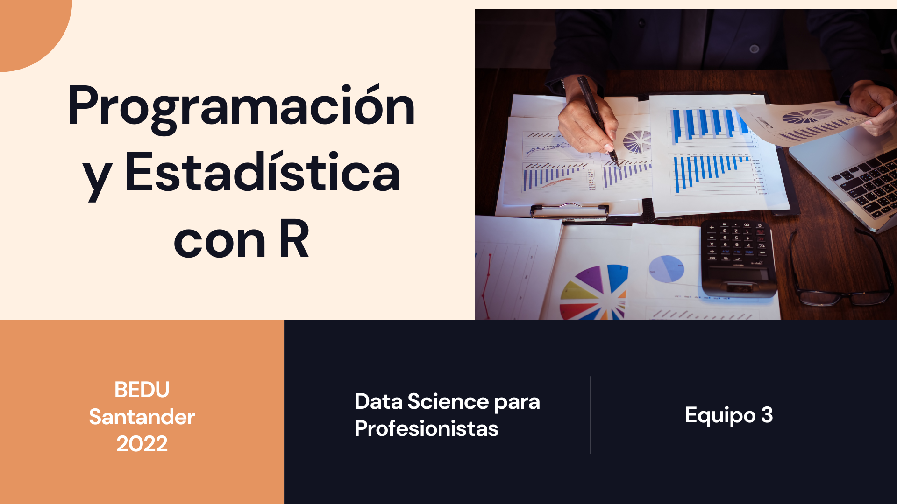

  

  
 
<h2 align="center"><strong>Becas Santander Universidades</h2>
<h2 align="center"><strong>Data Science para profesionistas | BEDU</h2>
<h3 align="center"><strong>Postworks del módulo "Programación y estadística con R Santander 2022" </h2>

## Acerca del proyecto ⚠️
Este repositorio fue creado para almacenar y presentar los `postworks` del modulo _"Programación y estadística con R Santander 2022"_ de la beca _"Becas Santander Tecnología | Data Science para profesionistas | BEDU"_.
***

## Requerimientos 📋
* R, RStudio

## Indíce 📖

- [PostWork 1](/PostWork1)
- [PostWork 2](/PostWork2)
- [PostWork 3](/PostWork3)
- [PostWork 4](/PostWork4)
- [PostWork 5](/PostWork5)
- [PostWork 6](/PostWork6)
- [PostWork 7](/PostWork7)
- [PostWork 8](/PostWork8)
- [Archivos fuente .R](/src)

## Ver video 
- [Clic para ver el video](https://www.youtube.com/watch?v=y23KqngJ5Qk)

    

## Ver presentación
 
[PostWorks 1-8](https://www.canva.com/design/DAFUsnCQp1M/hRHsCG2hrX7JwE3u9pf5RA/view?utm_content=DAFUsnCQp1M&utm_campaign=designshare&utm_medium=link&utm_source=publishsharelink)

    

